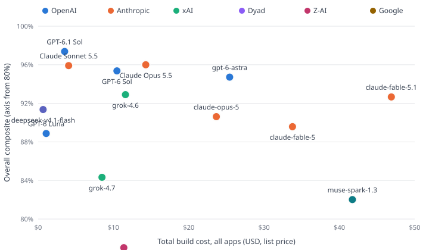

# App-Builder Benchmark — Results

Updated: 2026-09-29 · 23 registered model results.
Three primary apps (Relay CRM, Deskhero, Portalis), three milestones each.
Dyad local-agent mode; effort settings and local catalog pins are disclosed below. Per checkpoint: fixed Playwright CUJ
suites + adversarial security probes against pinned UI contracts, plus an LLM
judge (gpt-5.6-sol, single judge, input-capped). Composite per app =
60% CUJ + 25% probes + 15% judge; overall = mean of scored app composites.
Costs use the pinned list-price book and recorded per-request token counts
(cached/uncached/cache-write split). ≥ marks incomplete usage: a known-token
lower bound, excluded from cost/value charts. Judge and tool-service fees are excluded.
See [the harness and accounting audit](AUDIT.md) for repairs and rescore provenance.

| Model               | Relay CRM      | Deskhero       | Portalis       | Build time | Total cost | Overall   |
| ------------------- | -------------- | -------------- | -------------- | ---------- | ---------- | --------- |
| GPT-6.1 Sol         | 97.4% ($1.31)  | 97.0% ($1.20)  | 97.8% ($1.00)  | 42 min     | $3.52      | **97.4%** |
| Claude Opus 5.5     | 97.9% ($6.59)  | 93.7% ($3.97)  | 96.4% ($3.73)  | 49 min     | $14.29     | **96.0%** |
| Claude Sonnet 5.5   | 94.7% ($1.83)  | 96.5% ($1.18)  | 96.5% ($1.04)  | 21 min     | $4.05      | **95.9%** |
| GPT-6 Sol           | 95.0% ($4.30)  | 95.9% ($3.32)  | 95.2% ($2.84)  | 56 min     | $10.46     | **95.4%** |
| gpt-6-astra         | 97.6% ($8.77)  | 97.3% ($10.36) | 89.3% ($6.30)  | 50 min     | $25.43     | **94.7%** |
| gpt-5.6-sol         | 88.0% ($8.48)  | 95.2% (≥$6.82) | 96.1% ($4.86)  | 58 min     | ≥$20.16    | **93.1%** |
| grok-4.6            | 95.4% ($5.09)  | 88.4% ($2.81)  | 95.0% ($3.69)  | 96 min     | $11.59     | **92.9%** |
| claude-fable-5.1    | 97.1% ($19.65) | 91.0% ($10.03) | 89.8% ($17.22) | 102 min    | $46.90     | **92.7%** |
| deepseek-v4.1-flash | 91.7% ($0.31)  | 94.2% ($0.15)  | 88.2% ($0.19)  | 72 min     | $0.66      | **91.4%** |
| claude-opus-5       | 92.8% ($10.84) | 96.9% ($6.75)  | 82.1% ($6.06)  | 54 min     | $23.66     | **90.6%** |
| claude-fable-5      | 85.9% ($12.86) | 94.7% ($10.86) | 88.2% ($10.06) | 54 min     | $33.77     | **89.6%** |
| GPT-6 Luna          | 86.4% ($0.52)  | 86.5% ($0.25)  | 93.7% ($0.30)  | 81 min     | $1.07      | **88.9%** |
| grok-4.7            | 65.8% ($4.00)  | 96.5% ($2.60)  | 90.6% ($1.88)  | 41 min     | $8.48      | **84.3%** |
| muse-spark-1.3      | 97.0% ($9.36)  | 67.7% ($27.35) | 81.4% ($5.02)  | 169 min    | $41.73     | **82.0%** |
| glm-5.3             | 95.3% ($5.08)  | 62.1% ($3.96)  | 73.7% ($2.34)  | 83 min     | $11.38     | **77.0%** |
| gemini-3.8-flash    | 72.3% ($4.30)  | 67.7% ($1.63)  | 81.0% ($3.30)  | 73 min     | $9.23      | **73.7%** |
| auto-sidekick       | 87.6% ($11.98) | 83.8% ($5.40)  | 13.8% ($4.29)  | 63 min     | $21.67     | **61.7%** |
| gpt-5.6-terra       | 88.4% ($1.47)  | 87.7% ($2.28)  | 7.3% ($2.30)   | 25 min     | $6.05      | **61.1%** |
| gpt-5.6-luna        | 41.5% ($0.20)  | 95.9% ($0.14)  | 44.9% ($0.23)  | 37 min     | $0.57      | **60.8%** |
| claude-sonnet-5     | 7.5% ($8.21)   | 92.2% ($3.69)  | 81.8% ($2.77)  | 58 min     | $14.66     | **60.5%** |
| grok-4.5            | 93.8% ($1.91)  | 49.5% ($1.41)  | 14.3% ($1.50)  | 50 min     | $4.82      | **52.5%** |
| glm-5.3-flash       | 24.8% ($0.93)  | 93.1% ($0.43)  | 14.3% ($0.62)  | 162 min    | $1.99      | **44.1%** |
| mimo-v2.6-pro       | 90.0% ($0.35)  | —              | 13.8% (≥$0.22) | 126 min    | ≥$0.57     | **—**     |

<picture>
  <source media="(prefers-color-scheme: dark)" srcset="scatter-dark.svg">
  
</picture>

Historical Deskhero repeat notes — before the scoring/accounting repair

## GPT-6 Sol Deskhero — user-requested replicate (2026-09-22)

This is a fresh full generation at the same product-default **medium** effort, same pinned prompts and catalog (`catalog-2026-09-22-gpt6-sl.json`), and unchanged pricing. No model-output fixes or additional hints. **Leaderboard update (2026-09-22):** at the user’s explicit request, repeat1 now replaces the original Deskhero cell in the headline score, cost, and duration. Original artifacts and the comparison below are preserved. Relay CRM and Portalis remain their original runs; this is a mixed-run result, not a fresh three-app run.

| Run                          | Deskhero /100 | Build cost | Build minutes | Checkpoint checks passed |
| ---------------------------- | ------------: | ---------: | ------------: | ------------------------ |
| Original                     |          37.0 |      $2.44 |          14.8 | 12/12, 4/20, 3/22        |
| repeat1 (separate replicate) |          95.9 |      $3.21 |          17.8 | 12/12, 20/20, 22/22      |

The repeat passed all **33 customer-journey checks and 21 security probes**. Judge scores were 0.675, 0.725, and 0.775; all three score/judge pairs validated using `validateCheckpoint`. All milestone snapshots exist and all stream-error counts are zero. End-to-end run time was 22.9 minutes including setup and scoring. Costs above are generation costs, excluding judge calls.

**Why the difference:** the original milestone-2/3 `src/lib/auth/current-user.ts` granted the initial admin role only when `NODE_ENV === 'development'` and the email local part started with `admin+`. The scorer runs a production build, so admin personas became requesters and redirected to `/tickets`; admin-bootstrap was the first failure and many later checks failed at that prerequisite. The repeat's milestones 2 and 3 grant the same email-based role without the environment gate, and the admin workflows passed. The prompt's “Bootstrap rule (local dev)” wording remains ambiguous relative to production-mode evaluation. This is not evidence of 35 independent bugs in the original or of missing tables.

**Run integrity:** 162 wire requests used GPT-6 Sol at medium with a 128000 output cap: 161 HTTP 200 and one HTTP 502, followed by successful requests. The transient response recovered without a manual generation retry; no harness or generated-code changes were made. The wire verifier flags that non-200, which is disclosed rather than hidden. No judges were missing or needed replacement.

**Interpretation:** +58.9 points demonstrates sensitivity to one bootstrap decision under unchanged inputs, not a fresh three-app run. Each run is one sample; small score differences are noise, and this pair does not establish an expected score.

Artifacts: [validation](results/run-20260922-sol-deskhero-repeat/validation.json), [run state](results/run-20260922-sol-deskhero-repeat/state.json). Original cell: `gpt-6-sol-deskhero`; replicate: `gpt-6-sol-deskhero-repeat1`.

## GPT-6 Luna Deskhero — user-requested replicate (2026-09-22)

Fresh full generation at the same product-default **medium** effort, unchanged prompts, pinned catalog (`catalog-2026-09-22-gpt6-sl.json`), pricing, and budgets. No generated-code fixes or admin-bootstrap hints. **Leaderboard update (2026-09-22):** at the user’s explicit request, repeat1 now replaces the original Deskhero cell in the headline score, cost, and duration. Original artifacts and the comparison below are preserved. Relay CRM and Portalis remain their original runs; this is a mixed-run result, not a fresh three-app run.

| Run                          | Deskhero /100 | Build cost | Build minutes | Checkpoint checks passed |
| ---------------------------- | ------------: | ---------: | ------------: | ------------------------ |
| Original                     |          39.3 |      $0.33 |          27.1 | 12/12, 5/20, 3/22        |
| repeat1 (separate replicate) |      **86.5** |  **$0.24** |      **23.8** | **9/12, 19/20, 21/22**   |

The repeat passed **28/33 customer-journey checks and 21/21 security probes** (49/54 total). Judge scores were 0.55, 0.75, and 0.825; all three score/judge pairs validated with the exported `validateCheckpoint`. All three database snapshots were confirmed in PostgreSQL; each milestone recorded zero stream errors. End-to-end generation and scoring took 29.3 minutes. Costs are generation only, excluding judges.

**Why the improvement:** the original signup handler assigned the admin role only when `NODE_ENV !== "production"` and the email local part started with `admin+`. Production scoring therefore created requesters, blocking many downstream admin/agent checks. The repeat's `src/app/api/me/bootstrap-role/route.ts` applies the email rule without the environment gate, and the admin/agent workflow checks largely passed. The unchanged prompt's “local dev” bootstrap wording remains ambiguous relative to production-mode evaluation.

**Remaining failures:** three milestone-1 checks expected lowercase priority text (`high` / `medium`), but the UI displayed `High` / `Medium priority`; the milestone-2 bootstrap check reached the admin dashboard but expected lowercase `admin`, while the badge displayed `Admin`. The milestone-3 audit test filtered for literal `role_change`, while the generated audit UI renders that event as `Role change`. Source inspection confirms the role-change endpoint writes the event and the UI maps its label; the failed assertion alone does not establish missing audit persistence. These five UI-contract mismatches remain counted as failures; no tests or app code were adjusted.

**Run integrity:** all **124** wire requests used GPT-6 Luna at **medium**, with a **128000** output cap, and all returned HTTP 200. No retries, missing judges, harness repairs, or budget changes were needed.

**Interpretation:** +47.2 points on one independent repeat, not a fresh three-app run. Each run is one sample; this pair does not establish an expected score. Original Relay CRM remains 82.3 ($0.50, 34.4 minutes), Portalis 91.8 ($0.29, 23.4 minutes); the original three-app total was $1.11 and overall 71.2 before selecting repeat1. The demos use those canonical apps plus clearly labelled Deskhero repeat1.

Artifacts: [validation](results/run-20260922-luna-deskhero-repeat/validation.json), [run state](results/run-20260922-luna-deskhero-repeat/state.json). Original cell: `gpt-6-luna-deskhero`; repeat: `gpt-6-luna-deskhero-repeat1`.

### Luna video demos

[Watch all three apps (4:55)](https://wwwillchen-bot-mini.tail5775e4.ts.net:8443/demo-gpt-6-luna-all-apps.mp4). Order: original Relay CRM → Deskhero repeat1 → original Portalis. Durations below are rounded to the nearest second.

| Demo                                                                                                          | Duration | Tour steps | Failures retained in recording                                                                                                                                                                                                                                                                               |
| ------------------------------------------------------------------------------------------------------------- | -------: | ---------: | ------------------------------------------------------------------------------------------------------------------------------------------------------------------------------------------------------------------------------------------------------------------------------------------------------------ |
| [Relay CRM — original](https://wwwillchen-bot-mini.tail5775e4.ts.net:8443/demo-gpt-6-luna-relay-crm.mp4)      |     1:27 |      10/12 | Invite acceptance timed out; subsequent viewer-permissions assertion failed.                                                                                                                                                                                                                                 |
| [Deskhero — repeat1](https://wwwillchen-bot-mini.tail5775e4.ts.net:8443/demo-gpt-6-luna-deskhero-repeat1.mp4) |     2:15 |       6/12 | Agent queue ticket-opening failed, then dependent transition, note, reply/resolution and requester-reply steps failed; audit display assertion also failed. The ticket is visible in sample frames, but its queue link lacks the tour's `ticket-row` selector. These tour results are distinct from scoring. |
| [Portalis — original](https://wwwillchen-bot-mini.tail5775e4.ts.net:8443/demo-gpt-6-luna-portalis.mp4)        |     1:13 |      12/13 | Usage-dashboard visibility assertion failed.                                                                                                                                                                                                                                                                 |

**Video verification:** all three recordings are H.264, 1600×1000, yuv420p, 24 fps, with matching time bases. Combined via FFmpeg concat streamcopy (294.625 seconds), fully decoded without errors. Sample frames and the Deskhero repeat title were visually inspected. All four HTTPS URLs returned **200** for full requests and **206** for byte-range requests. Browser playback/seeking was not manually exercised.

**Serving change:** the existing Python gallery server did not support byte ranges. Tailscale direct-file serving could not read the external-drive files and was reverted. An existing Express library now serves only these four videos on loopback port 8091, with four explicit Tailscale routes. The gallery root proxy, other routes, videos, and index were preserved. The server uses no API credential. Details: `results/run-20260922-luna-deskhero-repeat/video-verification.json`, `video-server.pid`, and before/after Tailscale snapshots; launcher: `.claude/tmp/bench-20260921/serve-luna-videos.cjs` under the repository.

## Reasoning-effort sweep (luna + terra)

The main table generally runs models at the product default (medium for every
model except gpt-6-astra, whose default became `low` in Dyad's catalog on
2026-09-04; its headline row is the low cells and its medium run is the
non-default tier below). This sweep
re-runs the two cheapest models at `high` and `xhigh` — same harness, same
controls. Effort is applied at the recording proxy (`reasoning_effort` /
`reasoning.effort`) because Dyad's `thinkingBudget` setting exposes only
low/medium/high, so these rows do **not** use a product-reachable configuration
and are reported separately from the headline matrix.

| Model                  | Effort  | Relay CRM | Deskhero | Portalis | Cost    | Wall-clock | Overall   |
| ---------------------- | ------- | --------- | -------- | -------- | ------- | ---------- | --------- |
| grok-4.7               | default | 65.8%     | 96.5%    | 90.6%    | $8.48   | 41 min     | **84.3%** |
| grok-4.7               | high    | 77.2%     | 32.2%    | 83.9%    | $12.72  | 48 min     | **64.4%** |
| mimo-v2.6-pro          | default | 90.0%     | n/a      | 13.8%    | ≥$0.57  | 126 min    | **—**     |
| mimo-v2.6-pro          | high    | 93.3%     | n/a      | n/a      | ≥$0.44  | 75 min     | **—**     |
| gpt-5.6-luna           | medium  | 41.5%     | 95.9%    | 44.9%    | $0.57   | 37 min     | **60.8%** |
| gpt-5.6-luna           | high    | 78.6%     | 92.5%    | 6.9%     | $1.18   | 68 min     | **59.3%** |
| gpt-5.6-luna           | xhigh   | —         | —        | —        | $1.77   | 93 min     | **—**     |
| gpt-5.6-terra          | medium  | 88.4%     | 87.7%    | 7.3%     | $6.05   | 25 min     | **61.1%** |
| gpt-5.6-terra          | high    | 92.9%     | 96.6%    | 8.0%     | $9.91   | 43 min     | **65.9%** |
| gpt-5.6-terra          | xhigh   | —         | —        | —        | $15.81  | 61 min     | **—**     |
| grok-4.6               | medium  | 95.4%     | 88.4%    | 95.0%    | $11.59  | 96 min     | **92.9%** |
| grok-4.6               | high    | —         | 95.3%    | 81.6%    | ≥$11.33 | 94 min     | **—**     |
| gemini-3.8-flash       | medium  | 72.3%     | 67.7%    | 81.0%    | $9.23   | 73 min     | **73.7%** |
| gemini-3.8-flash       | high    | 73.3%     | 32.8%    | 95.8%    | $8.82   | 70 min     | **67.3%** |
| gpt-6-astra            | low     | 97.6%     | 97.3%    | 89.3%    | $25.43  | 50 min     | **94.7%** |
| gpt-6-astra            | medium  | 63.7%     | 97.0%    | 95.7%    | $43.53  | 83 min     | **85.5%** |
| deepseek-v4-flash-0731 | low     | 46.6%     | 82.0%    | 54.7%    | ≥$0.45  | 88 min     | **61.1%** |
| deepseek-v4-flash-0731 | high    | 58.5%     | 90.7%    | 52.9%    | $0.32   | 76 min     | **67.3%** |
| deepseek-v4-flash-0731 | xhigh   | —         | —        | —        | $0.28   | 72 min     | **—**     |

At N=1 a single build-breaking line moves an app column by 70+ points, which is
larger than the entire effort effect — read a column as measuring reasoning only
where every checkpoint in it built. See the PR discussion for the per-cell
diagnosis of each near-zero.

## Per-model failures

- **GPT-6.1 Sol**: clean sweep
- **Claude Opus 5.5**: m3-sla-set@deskhero:ckpt3, m3-workflow-regression@deskhero:ckpt3, P2-08@portalis:ckpt2
- **Claude Sonnet 5.5**: crm-m3-05@relay-crm:ckpt3
- **GPT-6 Sol**: crm-m3-05@relay-crm:ckpt3, S2-04@portalis:ckpt2
- **gpt-6-astra**: P2-03@portalis:ckpt2, P2-04@portalis:ckpt2, P2-06@portalis:ckpt2, P3-04@portalis:ckpt3
- **gpt-5.6-sol**: crm-m1-s02@relay-crm:ckpt1, crm-m2-s02@relay-crm:ckpt2, crm-m2-s03@relay-crm:ckpt2, crm-m3-05@relay-crm:ckpt3, crm-m3-s04@relay-crm:ckpt3, m3-audit-role@deskhero:ckpt3, S2-04@portalis:ckpt2
- **grok-4.6**: crm-m1-03@relay-crm:ckpt1, m2-p-self-promote@deskhero:ckpt2, m2-p-notes-leak@deskhero:ckpt2, m3-setup@deskhero:ckpt3, m3-sla-set@deskhero:ckpt3, m3-p-audit-leak@deskhero:ckpt3, P3-04@portalis:ckpt3
- **claude-fable-5.1**: m3-sla-set@deskhero:ckpt3, m3-overdue@deskhero:ckpt3, m3-overdue-clears@deskhero:ckpt3, P2-02@portalis:ckpt2, P2-09@portalis:ckpt2, P2-02@portalis:ckpt3, P3-04@portalis:ckpt3
- **deepseek-v4.1-flash**: crm-m2-02@relay-crm:ckpt2, crm-m3-05@relay-crm:ckpt3, crm-m3-07@relay-crm:ckpt3, m3-audit-role@deskhero:ckpt3, P1-06@portalis:ckpt2, P2-02@portalis:ckpt2, S2-01@portalis:ckpt2, S2-04@portalis:ckpt2, P2-02@portalis:ckpt3
- **claude-opus-5**: crm-m2-02@relay-crm:ckpt2, crm-m3-05@relay-crm:ckpt3, P2-02@portalis:ckpt2, P2-02@portalis:ckpt3, P3-01@portalis:ckpt3, P3-02@portalis:ckpt3, P3-03@portalis:ckpt3, P3-04@portalis:ckpt3, P3-09@portalis:ckpt3, S3-06@portalis:ckpt3
- **claude-fable-5**: crm-m2-01@relay-crm:ckpt2, crm-m2-02@relay-crm:ckpt2, crm-m2-s03@relay-crm:ckpt2, crm-m3-03@relay-crm:ckpt3, crm-m3-05@relay-crm:ckpt3, crm-m3-07@relay-crm:ckpt3, m3-audit-role@deskhero:ckpt3, P1-01@portalis:ckpt1, P1-02@portalis:ckpt1, P1-01@portalis:ckpt3, P3-09@portalis:ckpt3
- **GPT-6 Luna**: crm-m2-05@relay-crm:ckpt2, crm-m2-06@relay-crm:ckpt2, crm-m2-08@relay-crm:ckpt2, crm-m2-06@relay-crm:ckpt3, crm-m3-06@relay-crm:ckpt3, crm-m3-s08@relay-crm:ckpt3, m1-create@deskhero:ckpt1, m1-detail@deskhero:ckpt1, m1-edit@deskhero:ckpt1, m2-admin-bootstrap@deskhero:ckpt2, m3-audit-role@deskhero:ckpt3, P2-09@portalis:ckpt2, S2-04@portalis:ckpt2
- **grok-4.7**: crm-m2-02@relay-crm:ckpt2, crm-m2-03@relay-crm:ckpt2, crm-m2-04@relay-crm:ckpt2, crm-m2-08@relay-crm:ckpt2, crm-m2-03@relay-crm:ckpt3, crm-m3-01@relay-crm:ckpt3, crm-m3-02@relay-crm:ckpt3, crm-m3-03@relay-crm:ckpt3, crm-m3-04@relay-crm:ckpt3, crm-m3-05@relay-crm:ckpt3, crm-m3-07@relay-crm:ckpt3, crm-m3-s01@relay-crm:ckpt3, crm-m3-s02@relay-crm:ckpt3, crm-m3-s03@relay-crm:ckpt3, crm-m3-s04@relay-crm:ckpt3, crm-m3-s07@relay-crm:ckpt3, crm-m3-s08@relay-crm:ckpt3, P2-02@portalis:ckpt2, P2-09@portalis:ckpt2, P2-02@portalis:ckpt3
- **muse-spark-1.3**: m2-assign@deskhero:ckpt2, m2-agent-queue@deskhero:ckpt2, m2-happy-path@deskhero:ckpt2, m2-reopen@deskhero:ckpt2, m2-button-gating@deskhero:ckpt2, m2-notes@deskhero:ckpt2, m2-notes-hidden@deskhero:ckpt2, m2-p-skip-transition@deskhero:ckpt2, m2-p-notes-leak@deskhero:ckpt2, m3-overdue-clears@deskhero:ckpt3, m3-canned-apply@deskhero:ckpt3, m3-reply-thread@deskhero:ckpt3, m3-audit-transitions@deskhero:ckpt3, m3-workflow-regression@deskhero:ckpt3, m3-p-note-serialization@deskhero:ckpt3, m3-p-sla-edit-role@deskhero:ckpt3, P2-02@portalis:ckpt2, P2-09@portalis:ckpt2, P2-02@portalis:ckpt3, P3-01@portalis:ckpt3, P3-02@portalis:ckpt3, P3-03@portalis:ckpt3, P3-04@portalis:ckpt3, P3-09@portalis:ckpt3
- **glm-5.3**: crm-m2-s03@relay-crm:ckpt2, m1-close-reopen@deskhero:ckpt1, m2-assign@deskhero:ckpt2, m2-agent-queue@deskhero:ckpt2, m2-self-assign@deskhero:ckpt2, m2-happy-path@deskhero:ckpt2, m2-reopen@deskhero:ckpt2, m2-button-gating@deskhero:ckpt2, m2-notes@deskhero:ckpt2, m2-notes-hidden@deskhero:ckpt2, m2-p-skip-transition@deskhero:ckpt2, m2-p-notes-leak@deskhero:ckpt2, m3-sla-set@deskhero:ckpt3, m3-overdue-clears@deskhero:ckpt3, m3-canned-apply@deskhero:ckpt3, m3-reply-thread@deskhero:ckpt3, m3-audit-transitions@deskhero:ckpt3, m3-workflow-regression@deskhero:ckpt3, m3-p-note-serialization@deskhero:ckpt3, m3-p-sla-edit-role@deskhero:ckpt3, P1-06@portalis:ckpt1, P1-09@portalis:ckpt1, S1-01@portalis:ckpt1, S1-02@portalis:ckpt1, P1-06@portalis:ckpt2, P2-02@portalis:ckpt2, P2-09@portalis:ckpt2, S2-01@portalis:ckpt2, S2-04@portalis:ckpt2, S2-07@portalis:ckpt2, P2-02@portalis:ckpt3, P3-09@portalis:ckpt3, S3-04@portalis:ckpt3
- **gemini-3.8-flash**: crm-m1-05@relay-crm:ckpt1, crm-m1-06@relay-crm:ckpt1, crm-m1-05@relay-crm:ckpt2, crm-m2-02@relay-crm:ckpt2, crm-m2-03@relay-crm:ckpt2, crm-m2-04@relay-crm:ckpt2, crm-m2-05@relay-crm:ckpt2, crm-m2-06@relay-crm:ckpt2, crm-m2-08@relay-crm:ckpt2, crm-m2-06@relay-crm:ckpt3, crm-m3-06@relay-crm:ckpt3, crm-m3-s08@relay-crm:ckpt3, m1-create@deskhero:ckpt1, m1-detail@deskhero:ckpt1, m1-edit@deskhero:ckpt1, m1-close-reopen@deskhero:ckpt1, m1-delete@deskhero:ckpt1, m1-p-idor-read@deskhero:ckpt1, m1-p-idor-write@deskhero:ckpt1, m2-admin-bootstrap@deskhero:ckpt2, m3-overdue@deskhero:ckpt3, m3-overdue-clears@deskhero:ckpt3, m3-deactivate@deskhero:ckpt3, m3-reactivate@deskhero:ckpt3, m3-audit-transitions@deskhero:ckpt3, m3-workflow-regression@deskhero:ckpt3, m3-p-dead-cookie-read@deskhero:ckpt3, P1-09@portalis:ckpt1, S1-01@portalis:ckpt1, S1-02@portalis:ckpt1, P2-02@portalis:ckpt2, P2-09@portalis:ckpt2, S2-01@portalis:ckpt2, P2-02@portalis:ckpt3, P3-04@portalis:ckpt3
- **auto-sidekick**: crm-m1-s02@relay-crm:ckpt1, crm-m2-01@relay-crm:ckpt2, crm-m2-02@relay-crm:ckpt2, crm-m2-s02@relay-crm:ckpt2, crm-m3-07@relay-crm:ckpt3, m1-signout-guard@deskhero:ckpt1, m2-admin-bootstrap@deskhero:ckpt2, m2-create@deskhero:ckpt2, m3-audit-role@deskhero:ckpt3, m3-p-self-promote@deskhero:ckpt3, m3-p-audit-leak@deskhero:ckpt3, m3-p-note-serialization@deskhero:ckpt3, P1-03@portalis:ckpt1, P1-04@portalis:ckpt1, P1-05@portalis:ckpt1, P1-06@portalis:ckpt1, P1-07@portalis:ckpt1, P1-08@portalis:ckpt1, P1-09@portalis:ckpt1, S1-01@portalis:ckpt1, S1-02@portalis:ckpt1, P1-03@portalis:ckpt2, P1-06@portalis:ckpt2, P1-07@portalis:ckpt2, P2-01@portalis:ckpt2, P2-02@portalis:ckpt2, P2-03@portalis:ckpt2, P2-04@portalis:ckpt2, P2-05@portalis:ckpt2, P2-06@portalis:ckpt2, P2-07@portalis:ckpt2, P2-08@portalis:ckpt2, P2-09@portalis:ckpt2, S2-01@portalis:ckpt2, S2-02@portalis:ckpt2, S2-03@portalis:ckpt2, S2-04@portalis:ckpt2, S2-05@portalis:ckpt2, S2-06@portalis:ckpt2, S2-07@portalis:ckpt2, P2-02@portalis:ckpt3, P2-05@portalis:ckpt3, P3-01@portalis:ckpt3, P3-02@portalis:ckpt3, P3-03@portalis:ckpt3, P3-04@portalis:ckpt3, P3-05@portalis:ckpt3, P3-06@portalis:ckpt3, P3-07@portalis:ckpt3, P3-08@portalis:ckpt3, P3-09@portalis:ckpt3, S3-01@portalis:ckpt3, S3-02@portalis:ckpt3, S3-03@portalis:ckpt3, S3-04@portalis:ckpt3, S3-05@portalis:ckpt3, S3-06@portalis:ckpt3, S3-07@portalis:ckpt3, S3-08@portalis:ckpt3, S3-09@portalis:ckpt3
- **gpt-5.6-terra**: crm-m2-s03@relay-crm:ckpt2, crm-m3-03@relay-crm:ckpt3, crm-m3-05@relay-crm:ckpt3, crm-m3-s02@relay-crm:ckpt3, m1-signout-guard@deskhero:ckpt1, m3-deactivate@deskhero:ckpt3, m3-reactivate@deskhero:ckpt3, m3-workflow-regression@deskhero:ckpt3, P1-01@portalis:ckpt1, P1-02@portalis:ckpt1, P1-03@portalis:ckpt1, P1-04@portalis:ckpt1, P1-05@portalis:ckpt1, P1-06@portalis:ckpt1, P1-07@portalis:ckpt1, P1-08@portalis:ckpt1, P1-09@portalis:ckpt1, S1-01@portalis:ckpt1, S1-02@portalis:ckpt1, P1-03@portalis:ckpt2, P1-06@portalis:ckpt2, P1-07@portalis:ckpt2, P2-01@portalis:ckpt2, P2-02@portalis:ckpt2, P2-03@portalis:ckpt2, P2-04@portalis:ckpt2, P2-05@portalis:ckpt2, P2-06@portalis:ckpt2, P2-07@portalis:ckpt2, P2-08@portalis:ckpt2, P2-09@portalis:ckpt2, S2-01@portalis:ckpt2, S2-02@portalis:ckpt2, S2-03@portalis:ckpt2, S2-04@portalis:ckpt2, S2-05@portalis:ckpt2, S2-06@portalis:ckpt2, S2-07@portalis:ckpt2, P1-01@portalis:ckpt3, P2-02@portalis:ckpt3, P2-05@portalis:ckpt3, P3-01@portalis:ckpt3, P3-02@portalis:ckpt3, P3-03@portalis:ckpt3, P3-04@portalis:ckpt3, P3-05@portalis:ckpt3, P3-06@portalis:ckpt3, P3-07@portalis:ckpt3, P3-08@portalis:ckpt3, P3-09@portalis:ckpt3, S3-01@portalis:ckpt3, S3-02@portalis:ckpt3, S3-03@portalis:ckpt3, S3-04@portalis:ckpt3, S3-05@portalis:ckpt3, S3-06@portalis:ckpt3, S3-07@portalis:ckpt3, S3-08@portalis:ckpt3, S3-09@portalis:ckpt3
- **gpt-5.6-luna**: crm-m1-08@relay-crm:ckpt1, crm-m1-s02@relay-crm:ckpt1, crm-m2-01@relay-crm:ckpt2, crm-m2-02@relay-crm:ckpt2, crm-m2-03@relay-crm:ckpt2, crm-m2-04@relay-crm:ckpt2, crm-m2-05@relay-crm:ckpt2, crm-m2-06@relay-crm:ckpt2, crm-m2-07@relay-crm:ckpt2, crm-m2-08@relay-crm:ckpt2, crm-m2-s02@relay-crm:ckpt2, crm-m2-s03@relay-crm:ckpt2, crm-m2-s04@relay-crm:ckpt2, crm-m2-s06@relay-crm:ckpt2, crm-m1-08@relay-crm:ckpt3, crm-m2-03@relay-crm:ckpt3, crm-m2-06@relay-crm:ckpt3, crm-m3-01@relay-crm:ckpt3, crm-m3-02@relay-crm:ckpt3, crm-m3-03@relay-crm:ckpt3, crm-m3-04@relay-crm:ckpt3, crm-m3-05@relay-crm:ckpt3, crm-m3-06@relay-crm:ckpt3, crm-m3-07@relay-crm:ckpt3, crm-m3-s01@relay-crm:ckpt3, crm-m3-s02@relay-crm:ckpt3, crm-m3-s03@relay-crm:ckpt3, crm-m3-s04@relay-crm:ckpt3, crm-m3-s07@relay-crm:ckpt3, crm-m3-s08@relay-crm:ckpt3, P1-06@portalis:ckpt1, P2-02@portalis:ckpt2, P2-03@portalis:ckpt2, P2-04@portalis:ckpt2, P2-06@portalis:ckpt2, P2-07@portalis:ckpt2, P2-09@portalis:ckpt2, S2-03@portalis:ckpt2, S2-04@portalis:ckpt2, S2-07@portalis:ckpt2, P2-02@portalis:ckpt3, P2-05@portalis:ckpt3, P3-01@portalis:ckpt3, P3-02@portalis:ckpt3, P3-03@portalis:ckpt3, P3-04@portalis:ckpt3, P3-05@portalis:ckpt3, P3-06@portalis:ckpt3, P3-07@portalis:ckpt3, P3-08@portalis:ckpt3, P3-09@portalis:ckpt3, S3-01@portalis:ckpt3, S3-02@portalis:ckpt3, S3-03@portalis:ckpt3, S3-04@portalis:ckpt3, S3-05@portalis:ckpt3, S3-06@portalis:ckpt3, S3-07@portalis:ckpt3, S3-08@portalis:ckpt3, S3-09@portalis:ckpt3
- **claude-sonnet-5**: crm-m1-01@relay-crm:ckpt1, crm-m1-02@relay-crm:ckpt1, crm-m1-04@relay-crm:ckpt1, crm-m1-05@relay-crm:ckpt1, crm-m1-06@relay-crm:ckpt1, crm-m1-07@relay-crm:ckpt1, crm-m1-08@relay-crm:ckpt1, crm-m1-09@relay-crm:ckpt1, crm-m1-10@relay-crm:ckpt1, crm-m1-s01@relay-crm:ckpt1, crm-m1-s02@relay-crm:ckpt1, crm-m1-01@relay-crm:ckpt2, crm-m1-05@relay-crm:ckpt2, crm-m1-07@relay-crm:ckpt2, crm-m1-09@relay-crm:ckpt2, crm-m2-01@relay-crm:ckpt2, crm-m2-02@relay-crm:ckpt2, crm-m2-03@relay-crm:ckpt2, crm-m2-04@relay-crm:ckpt2, crm-m2-05@relay-crm:ckpt2, crm-m2-06@relay-crm:ckpt2, crm-m2-07@relay-crm:ckpt2, crm-m2-08@relay-crm:ckpt2, crm-m2-s01@relay-crm:ckpt2, crm-m2-s02@relay-crm:ckpt2, crm-m2-s03@relay-crm:ckpt2, crm-m2-s04@relay-crm:ckpt2, crm-m2-s05@relay-crm:ckpt2, crm-m2-s06@relay-crm:ckpt2, crm-m1-01@relay-crm:ckpt3, crm-m1-08@relay-crm:ckpt3, crm-m2-03@relay-crm:ckpt3, crm-m2-06@relay-crm:ckpt3, crm-m3-01@relay-crm:ckpt3, crm-m3-02@relay-crm:ckpt3, crm-m3-03@relay-crm:ckpt3, crm-m3-04@relay-crm:ckpt3, crm-m3-05@relay-crm:ckpt3, crm-m3-06@relay-crm:ckpt3, crm-m3-07@relay-crm:ckpt3, crm-m3-08@relay-crm:ckpt3, crm-m3-s01@relay-crm:ckpt3, crm-m3-s02@relay-crm:ckpt3, crm-m3-s03@relay-crm:ckpt3, crm-m3-s04@relay-crm:ckpt3, crm-m3-s05@relay-crm:ckpt3, crm-m3-s06@relay-crm:ckpt3, crm-m3-s07@relay-crm:ckpt3, crm-m3-s08@relay-crm:ckpt3, m2-create@deskhero:ckpt2, m3-audit-role@deskhero:ckpt3, P1-06@portalis:ckpt1, P1-06@portalis:ckpt2, P2-02@portalis:ckpt2, P2-04@portalis:ckpt2, S2-04@portalis:ckpt2, P2-02@portalis:ckpt3, P3-01@portalis:ckpt3, P3-09@portalis:ckpt3
- **grok-4.5**: crm-m2-02@relay-crm:ckpt2, crm-m2-s03@relay-crm:ckpt2, m2-promote-agent@deskhero:ckpt2, m2-assign@deskhero:ckpt2, m2-agent-queue@deskhero:ckpt2, m2-self-assign@deskhero:ckpt2, m2-happy-path@deskhero:ckpt2, m2-reopen@deskhero:ckpt2, m2-button-gating@deskhero:ckpt2, m2-notes@deskhero:ckpt2, m2-notes-hidden@deskhero:ckpt2, m2-p-agent-promote@deskhero:ckpt2, m2-p-skip-transition@deskhero:ckpt2, m2-p-unassigned-transition@deskhero:ckpt2, m2-p-notes-leak@deskhero:ckpt2, m3-setup@deskhero:ckpt3, m3-overdue-clears@deskhero:ckpt3, m3-canned-apply@deskhero:ckpt3, m3-reply-thread@deskhero:ckpt3, m3-deactivate@deskhero:ckpt3, m3-reactivate@deskhero:ckpt3, m3-audit-role@deskhero:ckpt3, m3-audit-transitions@deskhero:ckpt3, m3-workflow-regression@deskhero:ckpt3, m3-p-dead-cookie-read@deskhero:ckpt3, m3-p-dead-cookie-write@deskhero:ckpt3, m3-p-audit-leak@deskhero:ckpt3, m3-p-note-serialization@deskhero:ckpt3, m3-p-agent-deactivate@deskhero:ckpt3, m3-p-sla-edit-role@deskhero:ckpt3, P1-03@portalis:ckpt1, P1-04@portalis:ckpt1, P1-05@portalis:ckpt1, P1-06@portalis:ckpt1, P1-07@portalis:ckpt1, P1-08@portalis:ckpt1, P1-09@portalis:ckpt1, S1-01@portalis:ckpt1, S1-02@portalis:ckpt1, P1-03@portalis:ckpt2, P1-06@portalis:ckpt2, P1-07@portalis:ckpt2, P2-01@portalis:ckpt2, P2-02@portalis:ckpt2, P2-03@portalis:ckpt2, P2-04@portalis:ckpt2, P2-05@portalis:ckpt2, P2-06@portalis:ckpt2, P2-07@portalis:ckpt2, P2-08@portalis:ckpt2, P2-09@portalis:ckpt2, S2-01@portalis:ckpt2, S2-02@portalis:ckpt2, S2-03@portalis:ckpt2, S2-04@portalis:ckpt2, S2-05@portalis:ckpt2, S2-06@portalis:ckpt2, S2-07@portalis:ckpt2, P2-02@portalis:ckpt3, P2-05@portalis:ckpt3, P3-01@portalis:ckpt3, P3-02@portalis:ckpt3, P3-03@portalis:ckpt3, P3-04@portalis:ckpt3, P3-05@portalis:ckpt3, P3-06@portalis:ckpt3, P3-07@portalis:ckpt3, P3-08@portalis:ckpt3, P3-09@portalis:ckpt3, S3-01@portalis:ckpt3, S3-02@portalis:ckpt3, S3-03@portalis:ckpt3, S3-04@portalis:ckpt3, S3-05@portalis:ckpt3, S3-06@portalis:ckpt3, S3-07@portalis:ckpt3, S3-08@portalis:ckpt3, S3-09@portalis:ckpt3
- **glm-5.3-flash**: server_error@relay-crm:ckpt2, build_failed@relay-crm:ckpt3, m3-deactivate@deskhero:ckpt3, m3-reactivate@deskhero:ckpt3, P1-03@portalis:ckpt1, P1-04@portalis:ckpt1, P1-05@portalis:ckpt1, P1-06@portalis:ckpt1, P1-07@portalis:ckpt1, P1-08@portalis:ckpt1, P1-09@portalis:ckpt1, S1-01@portalis:ckpt1, S1-02@portalis:ckpt1, P1-03@portalis:ckpt2, P1-06@portalis:ckpt2, P1-07@portalis:ckpt2, P2-01@portalis:ckpt2, P2-02@portalis:ckpt2, P2-03@portalis:ckpt2, P2-04@portalis:ckpt2, P2-05@portalis:ckpt2, P2-06@portalis:ckpt2, P2-07@portalis:ckpt2, P2-08@portalis:ckpt2, P2-09@portalis:ckpt2, S2-01@portalis:ckpt2, S2-02@portalis:ckpt2, S2-03@portalis:ckpt2, S2-04@portalis:ckpt2, S2-05@portalis:ckpt2, S2-06@portalis:ckpt2, S2-07@portalis:ckpt2, P2-02@portalis:ckpt3, P2-05@portalis:ckpt3, P3-01@portalis:ckpt3, P3-02@portalis:ckpt3, P3-03@portalis:ckpt3, P3-04@portalis:ckpt3, P3-05@portalis:ckpt3, P3-06@portalis:ckpt3, P3-07@portalis:ckpt3, P3-08@portalis:ckpt3, P3-09@portalis:ckpt3, S3-01@portalis:ckpt3, S3-02@portalis:ckpt3, S3-03@portalis:ckpt3, S3-04@portalis:ckpt3, S3-05@portalis:ckpt3, S3-06@portalis:ckpt3, S3-07@portalis:ckpt3, S3-08@portalis:ckpt3, S3-09@portalis:ckpt3
- **mimo-v2.6-pro**: crm-m2-02@relay-crm:ckpt2, crm-m2-s03@relay-crm:ckpt2, crm-m3-05@relay-crm:ckpt3, crm-m3-07@relay-crm:ckpt3, P1-03@portalis:ckpt1, P1-04@portalis:ckpt1, P1-05@portalis:ckpt1, P1-06@portalis:ckpt1, P1-07@portalis:ckpt1, P1-08@portalis:ckpt1, P1-09@portalis:ckpt1, S1-01@portalis:ckpt1, S1-02@portalis:ckpt1, P1-03@portalis:ckpt2, P1-06@portalis:ckpt2, P1-07@portalis:ckpt2, P2-01@portalis:ckpt2, P2-02@portalis:ckpt2, P2-03@portalis:ckpt2, P2-04@portalis:ckpt2, P2-05@portalis:ckpt2, P2-06@portalis:ckpt2, P2-07@portalis:ckpt2, P2-08@portalis:ckpt2, P2-09@portalis:ckpt2, S2-01@portalis:ckpt2, S2-02@portalis:ckpt2, S2-03@portalis:ckpt2, S2-04@portalis:ckpt2, S2-05@portalis:ckpt2, S2-06@portalis:ckpt2, S2-07@portalis:ckpt2, P2-02@portalis:ckpt3, P2-05@portalis:ckpt3, P3-01@portalis:ckpt3, P3-02@portalis:ckpt3, P3-03@portalis:ckpt3, P3-04@portalis:ckpt3, P3-05@portalis:ckpt3, P3-06@portalis:ckpt3, P3-07@portalis:ckpt3, P3-08@portalis:ckpt3, P3-09@portalis:ckpt3, S3-01@portalis:ckpt3, S3-02@portalis:ckpt3, S3-03@portalis:ckpt3, S3-04@portalis:ckpt3, S3-05@portalis:ckpt3, S3-06@portalis:ckpt3, S3-07@portalis:ckpt3, S3-08@portalis:ckpt3, S3-09@portalis:ckpt3

## Caveats (disclosed by design)

- GPT-6.1 Sol: official API default medium via a benchmark-local 2026-09-29 catalog pin; absent from Dyad's live catalog at launch, so not a verified Dyad product default. 128000 output cap. Cache-write costs recovered from preserved raw Responses usage and verified against milestone ledger boundaries; no generated-app edits or build reruns.

- Sonnet 5.5: explicitly medium effort via a benchmark-local 2026-09-28 catalog pin (not a verified Dyad default; Anthropic API default is high), 128000 output cap. Fresh r2 cells follow an early recorder repair: engine message_stop usage had overwritten cache-token counts; the interrupted first attempt is preserved and excluded.

- N=1 per cell. Judge is gpt-5.6-sol for all candidates (user decision;
  same-vendor bias toward the gpt-5.6 family — bounded by the 15% judge weight).
- claude-sonnet-5 priced at intro rates (through 2026-08-31).
- Web tools enabled (product realism over reproducibility; web drift caveat).
- Durations exclude infra stalls (client-abort rows checked per cell).
- A complementary blind code review (opus-5, correctness/security/
  maintainability) lives in results/opus-review/ — behavioral scores and code
  quality diverge; see the PR discussion.

Regenerate: `node benchmarks/app-builder/report.mjs` (reads results/).
