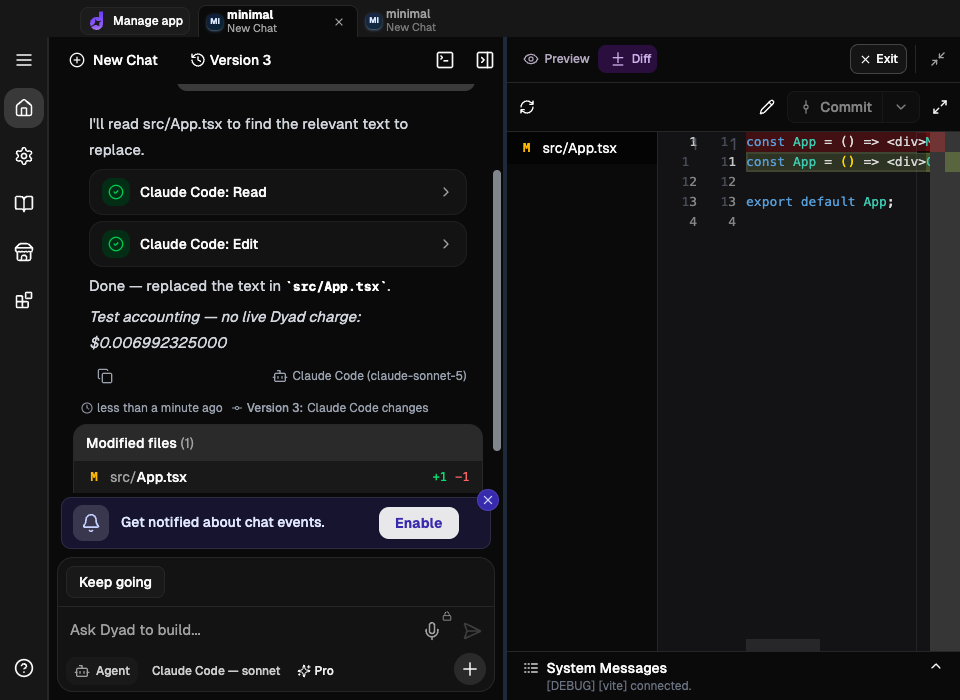

# Claude Code subscription prototype

Prototype delivery, 2026-09-04. **Live charging and commercial release approval
are unverified.** This branch is a functional local prototype, not a release-ready
subscription resale or billing implementation.

## Implemented

- Subscription / Pro credits / API key picker sections, CLI setup status and
  version checks, remembered subscription selection, first-use fee disclosure.
  Explicit API-key choices bypass Pro routing without changing global payment settings.
- Persisted chat backend and explicit CLI session ID. Cross-backend selection
  offers “Start new chat” / “Cancel” in the same app; no implied context transfer.
  Compatible model changes stay in the same backend. No “most recent” resumption.
- Main-process native CLI adapter outside Dyad's existing model/tool loop;
  streaming text and tool cards, in-chat approvals, cancellation and process
  cleanup. Actual assistant-model attribution is persisted; fallback is
  `Claude Code (model unavailable)`.
- Restricted built-ins, disabled shell/subagent/web tools, isolated MCP and
  hooks/plugins configuration, sanitized inherited environment. File permission
  requests reject paths outside the app, including existing symlink escapes.
  These are application guards, **not an OS sandbox**.
- Per-turn authenticated localhost MCP bridge for diagnostics, type checks,
  fixed project tests, validated dependency requests and preview restart. No
  arbitrary command or target-app arguments. Mutations require consent; Ask
  and Plan remove write tools and mutating MCP capabilities.
- Existing app resource coordination, pre-turn dirty-tree checkpoints, final
  commit/file review and preview refresh. Undo invalidates CLI sessions rather
  than replaying a transcript against restored files. Interrupted sessions
  require a fresh chat; existing history and changes remain visible.
- Durable usage outbox, crash recovery, admission gating, idempotent report
  retries and persisted receipts. Existing token-usage UI shows subscription
  pricing and the latest receipt; chat responses also show accounting status.
  Engine calculates charges, not the client.

## Run locally

Use the official native CLI, signed in through `claude auth login` outside
Dyad. Never paste credentials into Dyad. Validated versions: **2.1.260 and
2.1.261** (the CLI updated during validation). Prototype version guard accepts
2.1.259+ within the 2.1 series; other series fail closed.

After normal repository installation, launch a contract-compatible fixture:

```sh
./node_modules/.bin/esbuild scripts/claude_code_billing_fixture.ts --bundle --platform=node --format=cjs --outfile=.claude/tmp/claude-billing-fixture.cjs
node .claude/tmp/claude-billing-fixture.cjs
```

It prints a loopback URL. In a separate terminal start a disposable Dyad dev
profile with `DYAD_CLAUDE_BILLING_URL` set to that URL. The override is allowed
only in development/E2E and only for HTTP on 127.0.0.1. Fixture restart loses
reservations; keep it alive across Dyad restarts. Its synthetic catalog is not
an API list-price catalog and never debits money.

Select Subscription → Claude Code → sonnet, accept the disclosure and use a
disposable app. Without a fixture or the new production engine endpoints,
admission fails before execution; no API/Pro fallback occurs.

## Verification

The opt-in tests consume a real subscription:

```sh
./node_modules/.bin/esbuild scripts/claude_code_smoke.ts --bundle --platform=node --format=cjs --outfile=.claude/tmp/claude-smoke.cjs
node .claude/tmp/claude-smoke.cjs
npm run build
DYAD_REAL_CLAUDE_SMOKE=1 PLAYWRIGHT_HTML_OPEN=never npm run e2e -- claude_code_subscription.spec.ts
```

CLI smoke: real edit with approval, successful MCP diagnostics, streaming,
explicit resumption, phrase recall, Ask write/shell denial: **3 scenarios passed**.
Sanitized evidence: [CLI events](claude-code-prototype-cli-evidence.json).

Real Dyad/Electron smoke: **3 tests passed**, covering picker confirmation and
cancellation, actual footer, edit/preview, MCP diagnostics and approved type checks, continuing a chat
before and after restarting Dyad, read-only denial, switching to a new backend
chat, change review, undo/preview restoration and active-turn cancellation.
Usage payloads went to the test engine, not live billing. Evidence:
[usage events](claude-code-prototype-usage-evidence.json).



Focused tests cover pricing/cache/auxiliary calls, bridge authorization and
path guards, UTF-8 streaming, cancellation draining, outbox retry/crash recovery,
receipt handling, picker transitions and existing model-provider routing.
Formatting, lint, type-check and production Electron build pass. The broad run
reported 7,735 passed, four failed and one skipped. Three failures exposed an
adapter import-cycle regression; after fixing it, the context-banner integration
and existing stream-handler suites pass together (97 tests). The remaining
`boundary_inventory` dispatch-count failure reproduces on the clean baseline.
An existing `list_files` glob test depends on checkout/temp location: it fails
under the shared `.openclaw` prefix and passes with `TMPDIR=/tmp`; a standalone
glob reproduction and clean-baseline comparison isolate that behavior.

## Remaining release dependencies and boundaries

1. **Engine integration:** authoritative catalogs/category rates, credit-pool
   eligibility, balance reservations/enforcement, richer receipts and a
   reconciliation protocol. See the [endpoint contract](claude-code-track-usage-contract.md).
   The fixture proves formulas and idempotency, not real credit eligibility or debit.
2. **Commercial clarification:** the precise usage-indexed Dyad fee needs
   confirmation against Anthropic's terms. The user authorized this prototype;
   no commercial agreement was accepted or third party contacted.
3. **Incomplete usage:** per-model cache-write TTL is only assigned when one
   model exactly matches top-level usage. Ambiguous known-model pricing and
   missing cancellation/crash usage enter reconciliation, never the unknown-model
   fallback or a zero-cost receipt. Reported result usage is captured on failed
   and cancelled turns; speculative partial counts are not manufactured.
4. **Platform/security coverage:** real smoke is macOS arm64 only. Windows tree
   cleanup and Linux, managed policies, adversarial customization combinations,
   authentication expiry and quota exhaustion still need platform/operational
   qualification. Path guards cannot eliminate filesystem races or constrain
   project code executed by approved tests/dependency/preview operations.
5. **Workflow parity:** the current assembled user prompt/app rules are passed
   through, but every attachment format and selected-element path is not separately
   smoke-tested. Cloud/container execution and specialized Dyad integrations are
   not adapted to this local CLI backend. Subagents and arbitrary external MCP
   integrations are intentionally disabled. Existing separate Dyad services retain
   their own availability/billing; they are not included in Claude subscription use.
6. **Recovery:** cancelled/undone/forked CLI chats cannot resume execution;
   start a fresh chat. Outbox delivery retries at startup, admission and manual
   retry, not a background retry scheduler. Engine reconciliation is still required
   to unblock incomplete receipts. This conservative behavior is intentional.

Do not claim end-to-end charging is complete until the production engine has
been tested with real eligible credits and reconciled usage.
