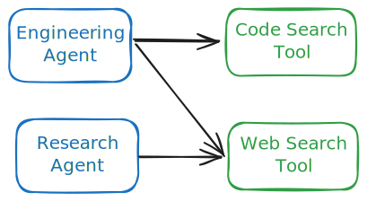

# Agents & Tools

In a nutshell, agents are bots that you can chat to (e.g. `@agent-name`) and tools are functions that agents can call to get stuff done (e.g. read a file, call GitHub API, or call an LLM).

This diagram shows the relationship between agents and tools:

As you can see, tools can be reused across agents.

## Why agents?

The power of agents and tools is that instead of trying to answer a prompt with a single LLM calls, you can programmatically break it down into distinct sub-problems and use technologies besides LLM to solve it. For example, LLMs are known to be unreliable for doing math, so instead you can outsource calculations to a tool like a Python executor.

## Why not agents?

The two biggest problems with agents are:

1. Reliability - agents still (in 2025) face significant reliability issues which means it requires close human oversight. In addition, you will oftentimes need heuristics (i.e. rules, regular coding logic) to ensure that the LLM outputs are usable and useful.
2. Cost - agents without close supervision can quickly become expensive because they can get stuck in wasteful loops - breaking other things while trying to fix something.

Dyad's approach to making agents practical for everyday developers is to let you build your own AI coding agent! This way you can do prompt engineering and give it rules to follow, which are specific to your codebase / team, and also give it additonal tools (e.g. get context from an internal wiki) that's crucial to solving the task.

## Next steps

If you want to learn more about building your own agent:

[Building an agent](../extensions/build-an-agent.md){.link-block data-title="Extension Guide"}
