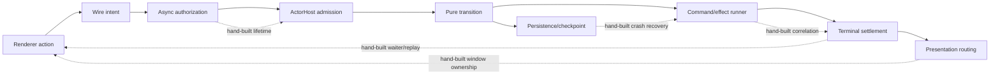
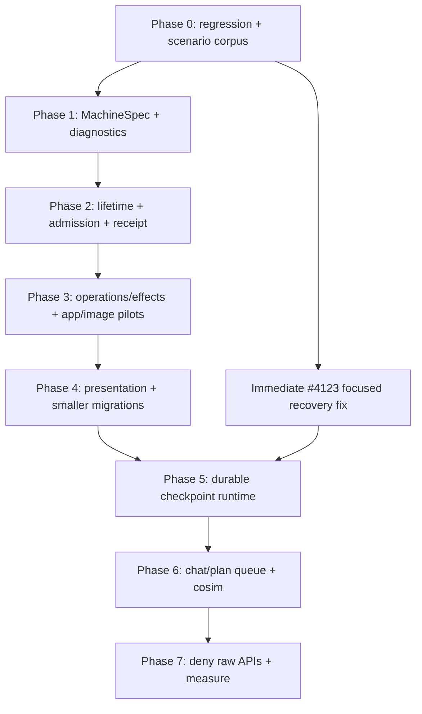

# Correct State Machines by Construction

**Status:** Proposed  
**Date:** 2026-07-28  
**Evidence window:** Merges after `1014afff63622100bbf2e8a76fb536afc8cb9c88`
through `9d4b4d2` on `main`  
**Scope:** State-machine, distributed-machine, ownership, effect, persistence,
renderer, and conformance-test frameworks

## Executive summary

The recent migration did not primarily expose bad pure transition functions. It
exposed many implicit state machines around otherwise explicit reducers:

- actor construction, admission, disposal, and recreation;
- transport delivery, authorization, deduplication, and retries;
- request correlation, runtime invocation, and terminal settlement;
- command effects, cancellation, and late producer output;
- per-window subscription and presentation ownership;
- entity deletion/reset barriers;
- persistence checkpoints, external side effects, and restart recovery; and
- owned queues spanning durable and ephemeral work.

Review has been acting as a high-quality but expensive concurrency explorer.
After the architecture ADR, 21 merged PRs accumulated 256 top-level inline
review findings. The five main production migrations account for 192 of those
findings and 95 commits. `rules/state-machines.md` grew from 277 to 499 lines,
but the APIs still allow authors to assemble the newly documented invalid
states.

The highest-leverage response is not XState, a new statechart DSL, or more
prose. It is an executable machine contract plus a small ownership runtime and
mandatory adversarial conformance, built on the existing dispatcher,
`ActorHost`, fake transport, reachability explorer, and `runCosim`.

The proposed author-facing model is:

1. Define one `MachineSpec` using a recipe appropriate to an entity actor,
   collection actor, shared window resource, or durable workflow.
2. Declare remote intent, admission, completion, retry, effect, lifecycle, and
   recovery semantics exhaustively.
3. Receive generated safe server adapters, a typed renderer
   `OperationHandle`, conformance suites, and a contract report.
4. Use explicitly named unsafe escape hatches only at composition roots, with a
   rationale and focused conformance coverage.

The framework should make its own invariants true by construction and
deterministically explore declared domain semantics. It must not claim to prove
arbitrary filesystem, Git, provider, compensation, or infinite-state behavior.

## Recommendation

Build three reinforcing layers:

| Layer                 | Purpose                                                                                          | Primary mechanism                                                                                                    |
| --------------------- | ------------------------------------------------------------------------------------------------ | -------------------------------------------------------------------------------------------------------------------- |
| Executable contract   | Make protocol and policy omissions visible at type-check or registration time                    | `MachineSpec`, discriminated recipes, branded identities, exhaustive intent/effect/outcome declarations              |
| Ownership runtime     | Make invalid lifetime, admission, retry, and settlement assembly unavailable through normal APIs | generation-safe leases, prepared admission, pinned receipt ledger, actor-owned operation scope, typed effect context |
| Generated conformance | Explore async interleavings TypeScript cannot prove                                              | tiered scenario packs, historical mutants, fault injection, cosimulation, leak checks, minimized traces              |

Retain the current pure TypeScript reducer model. Transition syntax was not the
dominant source of review churn. An optional exhaustive transition-table helper
can follow if reducer omissions remain measurable after the protocol and
lifetime work.

## Evidence and methodology

### What was examined

The analysis used:

- the first-parent merge history after the baseline commit;
- all current GitHub review threads for those merged PRs, including comments
  added after merge;
- commit subjects and follow-up iterations;
- changes to `rules/state-machines.md`;
- the current implementation of `src/state_machines/`,
  `src/distributed_machines/`, all six distributed definitions, domain remote
  managers, presentation services, and deletion/reset fences;
- the existing architecture ADR, state-machine hardening plans, and machine
  rules; and
- independent PM, engineering, and UX/DX reviews followed by a cross-role
  challenge.

Counts are a snapshot from 2026-07-28. GitHub review can continue after merge;
for example, the newest version-preview recovery finding arrived after PR
[#4123](https://github.com/dyad-sh/dyad/pull/4123) had merged.

### PR inventory

“Findings” below means top-level GitHub review threads, excluding replies.

| PR                                                 | Focus                                   | Commits | Findings | Main signal                                                  |
| -------------------------------------------------- | --------------------------------------- | ------: | -------: | ------------------------------------------------------------ |
| [#4097](https://github.com/dyad-sh/dyad/pull/4097) | Golden single-window behavior           |       3 |        0 | Established migration parity                                 |
| [#4098](https://github.com/dyad-sh/dyad/pull/4098) | Explicit preview runtime owners         |       3 |        1 | Ownership began moving to main                               |
| [#4099](https://github.com/dyad-sh/dyad/pull/4099) | App-run codecs and safe projection      |       6 |        4 | Independently valid key/event schemas were not jointly valid |
| [#4101](https://github.com/dyad-sh/dyad/pull/4101) | Transport-neutral app runtime           |       4 |        4 | Compatibility and delivery boundaries                        |
| [#4103](https://github.com/dyad-sh/dyad/pull/4103) | C2 registry documentation               |       2 |        0 | Documentation only                                           |
| [#4102](https://github.com/dyad-sh/dyad/pull/4102) | Multi-window infrastructure and harness |       6 |        5 | Window lifetime and shared ownership                         |
| [#4100](https://github.com/dyad-sh/dyad/pull/4100) | Local distributed actor kernel          |      14 |       14 | Construction/disposal/reentrancy invariants                  |
| [#4104](https://github.com/dyad-sh/dyad/pull/4104) | Audit delivery rewiring                 |      11 |        6 | Projection and delivery compatibility                        |
| [#4105](https://github.com/dyad-sh/dyad/pull/4105) | Remote transport                        |       9 |       10 | Authorization TOCTOU, dedupe, and subscription admission     |
| [#4106](https://github.com/dyad-sh/dyad/pull/4106) | Remote client and React binding         |       3 |        2 | Bootstrap generation and ref-count leaks                     |
| [#4108](https://github.com/dyad-sh/dyad/pull/4108) | App-run authority migration             |      14 |       31 | Request/runtime identity and waiter settlement               |
| [#4109](https://github.com/dyad-sh/dyad/pull/4109) | Delete legacy app-run path              |       2 |        2 | Cutover safety                                               |
| [#4116](https://github.com/dyad-sh/dyad/pull/4116) | GitHub operations migration             |       5 |       11 | Routing ownership and terminal cleanup                       |
| [#4117](https://github.com/dyad-sh/dyad/pull/4117) | Delete legacy GitHub path               |       1 |        0 | Cutover safety                                               |
| [#4122](https://github.com/dyad-sh/dyad/pull/4122) | Main registry hardening                 |       2 |        3 | Unresolved-entry retention reappeared outside actors         |
| [#4121](https://github.com/dyad-sh/dyad/pull/4121) | Image-generation migration              |      10 |       19 | Effect settlement, deletion, retention, presentation         |
| [#4124](https://github.com/dyad-sh/dyad/pull/4124) | Release workflow hardening              |       1 |        4 | Unrelated to the state-machine program                       |
| [#4126](https://github.com/dyad-sh/dyad/pull/4126) | Stop stream versus queued prompts       |       3 |        3 | Cross-owner cancellation policy                              |
| [#4119](https://github.com/dyad-sh/dyad/pull/4119) | Chat/plan authority migration           |      50 |       96 | Queue ownership, finalization, tombstones, deletion          |
| [#4120](https://github.com/dyad-sh/dyad/pull/4120) | Delete legacy chat adapters             |       4 |        6 | Compatibility and cleanup                                    |
| [#4123](https://github.com/dyad-sh/dyad/pull/4123) | Version-preview migration               |      16 |       35 | Persistence, Git recovery, window interest, presentation     |
| **Total**                                          |                                         | **169** |  **256** |                                                              |

Additional signals:

- Excluding unrelated #4124 leaves 252 state-machine-program findings,
  including 67 HIGH/P1 findings.
- The foundation sequence #4097–#4106 produced 46 findings and 61 commits.
- The five production migrations #4108, #4116, #4121, #4119, and #4123
  produced 192 findings, 75% of the total, and 90 follow-up commits after their
  first implementation commits.
- At least 123 of 139 replies to inline findings explicitly said “Fixed” or
  “Addressed”; only five were clearly rebutted or intentional by conservative
  phrase matching. This was predominantly real defect discovery.
- Fifty-eight commit subjects explicitly used “fix,” “address,” “harden,” or
  “review.”
- `rules/state-machines.md` grew from 277 to 499 lines and from 67 to 114 rule
  bullets: 47 new rules capturing review-discovered edge cases.
- Only six of the thirteen machine directories inventoried by the current
  boundary test use the shared matrix/reachability drivers. Only three of six
  current distributed definitions have reachability coverage, and `runCosim`
  has no domain-machine users.

### Foundation failure distribution

Classifying the 46 foundation findings by primary cause gives:

| Primary cause                                                 | Finding instances |
| ------------------------------------------------------------- | ----------------: |
| Actor/subscription lifetime, admission, and disposal barriers |                17 |
| Identity, correlation, authorization, and deduplication       |                 9 |
| Bounded retention, backpressure, and resource ownership       |                 8 |
| Cross-window projection and delivery compatibility            |                 5 |
| Error isolation and classification                            |                 4 |
| Abort and terminal-settlement semantics                       |                 3 |

These are finding instances rather than deduplicated bugs. Repetition is
intentional because review iteration is the churn this plan aims to reduce.

## Diagnosis: the implicit machines around the reducer

The current reducer kernel already has several good foundations:

- explicit discriminated `TransitionResult` values;
- a transactional dispatcher;
- `ActorHost` and remote transport/client layers;
- `TaskScope`, `TimerLease`, `InvocationRef`, and invocation registries;
- reachable-state exploration and controller/host conformance;
- fake clocks and a fake duplex transport;
- `runCosim`; and
- trace support.

The problem is that correctness-critical protocol state remains distributed
across callbacks, maps, booleans, service objects, and renderer hooks:



The reducer is explicit; the dotted relationships are usually not. Each dotted
relationship is another state machine, but today it is assembled ad hoc.

### Recurring failure modes and the missing framework guarantee

| Failure mode                                  | Review evidence                                                                                                                                                                                                                                                                                                       | Why the current API permits it                                                                         | Required construction guarantee                                                                    |
| --------------------------------------------- | --------------------------------------------------------------------------------------------------------------------------------------------------------------------------------------------------------------------------------------------------------------------------------------------------------------------- | ------------------------------------------------------------------------------------------------------ | -------------------------------------------------------------------------------------------------- |
| Construction/disposal overlap                 | [same key reserved through disposal](https://github.com/dyad-sh/dyad/pull/4100#discussion_r3649652336), [dispose barrier published too late](https://github.com/dyad-sh/dyad/pull/4100#discussion_r3649813313)                                                                                                        | Parallel maps encode an implicit combined lifetime; async factories register too late                  | One explicit lifetime slot and a synchronously published, generation-bound lease                   |
| Ingress bypasses deletion/reset               | [host ingress bypass](https://github.com/dyad-sh/dyad/pull/4100#discussion_r3649695510), [machine disposal admission](https://github.com/dyad-sh/dyad/pull/4100#discussion_r3649739209)                                                                                                                               | Local refs, command output, and remote dispatch have different gates                                   | One host-level admission transaction for every external ingress path                               |
| Authorization TOCTOU                          | [disconnect during authorization](https://github.com/dyad-sh/dyad/pull/4105#discussion_r3649973570), [stale before execution](https://github.com/dyad-sh/dyad/pull/4105#discussion_r3649973571)                                                                                                                       | Authorization returns a boolean, then identity/lifetime changes before admission                       | Authorization mints an actor/window/revision-bound lease consumed by synchronous admission         |
| Unsettled dedupe eviction                     | [unresolved entry eviction](https://github.com/dyad-sh/dyad/pull/4105#discussion_r3649973572)                                                                                                                                                                                                                         | One cache combines in-flight capacity and settled retention                                            | Pending receipt entries are pinned; in-flight and settled bounds are separate                      |
| Subscription ownership drift                  | [subscribe after unsubscribe](https://github.com/dyad-sh/dyad/pull/4105#discussion_r3650473473), [subscription admission bypass](https://github.com/dyad-sh/dyad/pull/4105#discussion_r3650647895)                                                                                                                    | Retain, refresh, bootstrap, and release are separately callable                                        | A generation-bound subscription lease; refresh never acquires ownership                            |
| Request versus invocation aliasing            | [request/runtime waiter mismatch](https://github.com/dyad-sh/dyad/pull/4108#discussion_r3651244079), [concurrent ensure alias](https://github.com/dyad-sh/dyad/pull/4108#discussion_r3651899078)                                                                                                                      | One string is reused for transport, request, runtime, and replay roles                                 | Branded identities and an actor-owned operation ledger with distinct request and invocation fields |
| Lost or ambiguous completion                  | [runtime failure reported as success](https://github.com/dyad-sh/dyad/pull/4108#discussion_r3651278300), [disposal strands waiters](https://github.com/dyad-sh/dyad/pull/4108#discussion_r3651320102)                                                                                                                 | Raw dispatch reports admission only; command runners can omit terminal output; waiter maps are bespoke | Typed admission/completion APIs, exhaustive effect outcomes, exactly-once in-process settlement    |
| Stale queue mutation                          | [queue edit races admission](https://github.com/dyad-sh/dyad/pull/4119#discussion_r3662789336), [stale queue mutation](https://github.com/dyad-sh/dyad/pull/4119#discussion_r3660023694)                                                                                                                              | Revision checks and side effects are split across owners                                               | Actor-owned claim/CAS before side effects, explicit owner capability, typed rollback/settlement    |
| Late producer recreates deleted actor         | [actor creation races deletion](https://github.com/dyad-sh/dyad/pull/4119#discussion_r3661869466), [tombstone cleared early](https://github.com/dyad-sh/dyad/pull/4119#discussion_r3663014184)                                                                                                                        | Effect output uses creating `ensure()` paths and deletion fences do not own continuations              | Non-creating captured actor sink plus a fence that drains construction and command continuations   |
| Presentation misroutes or evicts live work    | [duplicate operation can hijack result routing](https://github.com/dyad-sh/dyad/pull/4123#discussion_r3661190240), [final window release races actor creation](https://github.com/dyad-sh/dyad/pull/4123#discussion_r3661759182)                                                                                      | Three services implement different initiator maps and capacity policies                                | One first-writer, generation-bound route registry with unresolved claims pinned                    |
| UI acts before authoritative admission        | [pane hidden before cleanup accepted](https://github.com/dyad-sh/dyad/pull/4123#discussion_r3661759180)                                                                                                                                                                                                               | Raw receipt promises are discarded or transport “applied” is treated as domain completion              | Generated operation facade exposes distinct admission and completion milestones                    |
| Persistence closes over partial external work | [startup reconcile overwrites active operation](https://github.com/dyad-sh/dyad/pull/4123#discussion_r3661037535), [checkpoint switch ordering](https://github.com/dyad-sh/dyad/pull/4123#discussion_r3661048591), [post-merge interrupted restore](https://github.com/dyad-sh/dyad/pull/4123#discussion_r3668326229) | Persistence is declarative only; effects can start before an exact recovery checkpoint is flushed      | Checkpoint-before-effect runtime, exact progress schema, hydration barrier, domain reconciliation  |

### Current framework-level gaps

1. Six server definitions widen a renderer intent schema to the full internal
   event union with `as z.ZodType<...Event>`. The client definition then
   duplicates codecs. Producer-only events and host-enriched metadata are not
   structurally excluded from the renderer boundary.
2. `RemoteMachineContract` accepts independently decoded key and event values
   plus an arbitrary async `authorizeDispatch` callback. The callback can mutate
   parsed data, and the key/event/sender/hash relationship is not one typed
   admission operation.
3. `ActorLifecyclePolicy` is a bag of loosely related booleans and optional
   hooks. Invalid or underspecified policy combinations are representable.
4. `ActorHost` tracks construction, activation, machine construction, machine
   disposal, host disposal, and cleanup in parallel maps. The combined
   lifecycle is implicit.
5. `createCommandRunner` is an arbitrary function. No type requires each
   command to classify itself as correlated, streaming, checkpointed, or
   intentionally fire-and-forget, or to produce success/failure/cancellation
   output.
6. `RemoteActorRef.dispatch()` returns a raw transport receipt. Callers can
   discard rejection, confuse admission with completion, or change UI state
   before authoritative acceptance.
7. Request completion, last-settlement replay, retained subscriptions, waiters,
   resync, and retry are repeated in domain managers. Roughly 1,332 lines of
   bespoke remote-manager glue sit above the 753-line generic remote client.
8. GitHub operations, image generation, and version preview each implement a
   subtly different initiating-window map. Deletion/reset fences are also
   duplicated across app, chat, image, GitHub, and version services.
9. `MachinePersistencePolicy` declares intent but does not enforce a durable
   flush before an external mutation or a restart reconciliation barrier.
10. The conformance infrastructure is capable but opt-in. A new distributed
    definition can land without two-window, disconnect, duplicate, disposal, or
    reachability coverage.

## Assurance boundary

“Correct by construction” must have a precise meaning.

### Guaranteed by the type/contract layer

- Remote renderer intents are a different type and schema from trusted internal
  events.
- Identity roles are distinct opaque types: delivery message, idempotency,
  request correlation, runtime invocation, actor instance, actor revision,
  queue revision, window session, and presentation epoch.
- Every remote intent declares admission versus completion semantics,
  retry/idempotency policy, authorization, size budget, and key relationship.
- Every command declares its effect kind and required terminal mapping.
- Lifecycle and persistence choices are discriminated recipes; hooks required
  by a selected policy cannot be omitted.
- New variants cannot silently fall through exhaustive inventories.

### Guaranteed by the in-process runtime

- A fence closes admission synchronously before the first `await`.
- A stale release cannot release a newer lifetime.
- Every ingress path passes the same final synchronous admission gate.
- Pending delivery and operation records cannot be evicted.
- Accepted in-process operations settle at most once; disposal settles or
  explicitly transfers every unresolved operation.
- Subscription refresh cannot increment ownership.
- Late effect output cannot create a replacement actor.
- Route ownership is first-writer and cannot silently change under capacity
  pressure.
- Owned tasks, timers, waiters, routes, and subscriptions are observable and
  drainable.

These guarantees hold within the declared host/session lifetime. An in-memory
receipt ledger does not provide exactly-once behavior across process crashes.

### Established by deterministic model and fault testing

- All enumerated state/event combinations and declared effect outcomes are
  checked.
- Bounded async interleavings are explored and report whether the search was
  exhaustive or hit a bound.
- Disconnect, remount, duplicate, dispose, delete, reentry, and crash points
  are injected systematically.
- Cross-machine ownership protocols are cosimulated where required.
- Invariants, terminal settlement, and zero-resource postconditions are checked
  for every generated scenario.

### Explicitly domain-owned and not generically proven

- Whether scheduling, supersession, staleness, or retry policy is correct for
  the product.
- Exactly-once behavior of Git, filesystem, network, or provider effects.
- Whether a compensation operation restores the intended business state.
- Whether every state in an unbounded data domain has been explored.
- Crash safety for a machine that has not selected and implemented a durable
  policy.
- User-visible semantics of ignored, rejected, cancelled, or superseded work.

The framework requires these policies to be declared and testable; it does not
invent them.

## Design principles

1. **Mechanism in the framework, policy in the domain.** The framework owns
   identity, lifetime, accounting, linearization, and observability. Machines
   own scheduling, supersession, compensation, retry eligibility, and UX
   meaning.
2. **One safe facade for ordinary authors.** Recipes and generated adapters
   hide low-level lease assembly. Low-level primitives remain available to
   framework authors and explicit unsafe escape hatches.
3. **Acceptance contracts before abstraction.** Encode accepted review findings
   as failing scenarios before extracting the primitive meant to prevent them.
4. **No conflated milestones.** Transport admission, durable domain acceptance,
   execution start, and terminal settlement are distinct optional facts.
5. **No conflated identities.** Two identity values may intentionally be equal,
   but their types and fields remain distinct.
6. **No invisible retries.** A mutating intent opts into bounded stable-ID retry
   explicitly; destructive or non-idempotent work does not inherit a generic
   retry default.
7. **No pending eviction.** Capacity limits reject new admission; they do not
   forget unresolved ownership or dedupe records.
8. **No creating late sinks.** Effect continuations target the actor instance
   that authorized them and cannot `ensure()` a successor into existence.
9. **Diagnostics are part of correctness.** Every failed generated scenario
   produces a minimized, redacted, reproducible trace.
10. **Preserve external behavior during extraction.** Keep IPC envelopes,
    renderer façades, and golden behavior stable through compatibility adapters.

## Proposed architecture

### 1. Executable `MachineSpec`

Add a thin, runtime-available contract builder. “Builder” is preferred over
“compiler” in APIs because it enforces declarations and generates adapters and
tests; it does not prove arbitrary TypeScript.

The exact API should be prototyped, but its conceptual shape is:

```ts
const spec = defineMachineSpec({
  state: {
    initialState,
    transition,
    keyOf,
    variants,
    invariants,
  },

  lifecycle: entityActor({
    terminal: isTerminal,
    admissionDuringDisposal: cleanupIntents,
  }),

  remote: remoteProtocol({
    keyCodec,
    snapshotCodec,
    intents: {
      START: remoteIntent({
        codec: startIntentCodec,
        completion: "await-settlement",
        retry: stableIdRetry({ maxAttempts: 2 }),
        authorization: "entity-member",
      }),
      STOP: remoteIntent({
        codec: stopIntentCodec,
        completion: "admission-only",
        retry: "none",
        authorization: "entity-member",
      }),
    },
    admit: admitRemoteIntent,
  }),

  effects: defineEffects({
    StartRuntime: correlatedEffect({
      /* ... */
    }),
    PublishStatus: fireAndForgetEffect({
      /* ... */
    }),
  }),

  outcomes: defineOutcomes({
    requestId: (request) => request.requestId,
    retention: boundedOutcomes({ maxSettled: 64 }),
  }),

  testing: {
    fixtures,
    capabilities,
    exclusions,
    domainScenarios,
  },
});
```

The builder must:

- use `satisfies Record<Variant, ...>`-style maps to keep variant inventories
  exhaustive without deeply recursive type machinery;
- keep wire intent conversion, lifecycle/ownership, effect completion, and
  request milestones as four orthogonal contracts;
- require explicit exclusions, with reasons, for intentionally unreachable
  variants or scenarios;
- generate a stable contract report for review;
- expose recipe defaults, not dozens of equally prominent scopes; and
- require any manual/unsafe hook to include a rationale and focused tests.

#### Lifecycle recipes

Replace independent lifecycle booleans with discriminated recipes:

- `ephemeralEntityActor`
- `retainedEntityActor`
- `singletonCollectionActor`
- `windowInterestResource`
- `persistentEntityActor`

Selecting a recipe makes its required policy explicit. For example, a
persistent recipe must supply schema version, load, save, hydration behavior,
and reconciliation. A bounded terminal actor must supply a terminal classifier
and retention policy. Unsupported combinations fail at definition registration.

Recipes compose lower-level primitives but ordinary domain authors do not
manually wire those primitives.

### 2. Purpose-branded identities

Introduce or standardize opaque types for:

- `TransportMessageId`
- `IdempotencyKey`
- `RequestId`
- `InvocationRef`
- `ActorInstanceId`
- `ActorRevision`
- `QueueRevision`
- `WindowSessionId`
- `PresentationEpoch`

No generic `operationId: string` should stand in for multiple roles. Named
conversion functions are allowed where a domain intentionally derives one role
from another; an assignment or cast is not.

Traces and contract reports display all identity roles in aligned columns so a
reviewer can see accidental aliasing.

### 3. One lifetime substrate, specialized internally

Implement one opaque `LifetimeLease` substrate. Build admission,
subscription, presentation-owner, and deletion/reset behavior on it.

Required properties:

- generation-specific, opaque, idempotent release;
- stale release cannot affect a replacement generation;
- first acquisition and final release are linearized;
- synchronous fence publication before async cleanup;
- tracked work registers before its async factory is invoked;
- owner disposal invalidates post-`await` continuations;
- cleanup-safe events are explicitly classified; and
- owned resources are enumerable for leak assertions and traces.

#### Explicit host lifetime

Replace `ActorHost`’s parallel construction/activation/disposal maps with one
explicit keyed slot:

```ts
type LifetimeSlot<Actor> =
  | { kind: "constructing"; generation: number; lease: LifetimeLease }
  | { kind: "active"; generation: number; actor: Actor }
  | { kind: "disposing"; generation: number; barrier: Promise<void> };
```

Machine and host lifetime should use the same explicit vocabulary. This removes
combined states such as “construction map cleared but disposal cleanup still
running” from the representable implementation.

#### Keyed admission and disposal

An internal `KeyedAdmissionScope` should:

- close admission synchronously;
- adopt actors already under construction;
- include command-runner continuations and child creation in its drain barrier;
- gate remote, local-ref, handler, and producer ingress at `ActorHost`;
- revalidate after every authorization `await`; and
- allow only spec-declared cleanup/cancellation intents during a fence.

This replaces domain deletion/reset fence maps. A domain can still decide
whether a failed delete reopens admission, but it receives a generation-bound
reopen capability rather than toggling a boolean.

#### Prepared admission transaction

Authorization must not merely return `true`. It should produce an opaque
prepared admission bound to:

- canonical actor key;
- actor instance and revision;
- window session;
- decoded immutable intent fingerprint; and
- the relevant deletion/reset generation.

Final synchronous admission consumes that capability. If any bound fact has
changed, admission returns a typed stale/closed result. This closes the
authorization-to-dispatch gap for both existing and newly constructed actors.

### 4. Separate wire intent from internal event

Evolve the distributed definition from one `Event` generic to
`RemoteIntent` plus trusted `Event`:

```ts
defineRemoteProtocol<ActorKey, RemoteIntent, Event, Snapshot>({
  intentCodec,
  snapshotCodec,
  admit({ key, intent, sender, prepared }): Event {
    // Creates a new immutable host event.
  },
});
```

Requirements:

- Renderer codecs cannot express producer/completion-only events.
- Host sender metadata is created during admission, not accepted as optional
  renderer input and mutated later.
- Key and event identity are checked jointly in one conversion.
- Expected denial is a typed value; unexpected dependency/programming errors
  remain observable.
- Intent and snapshot size budgets are declared together.
- The generated client definition imports the shared wire contract instead of
  duplicating codecs.
- The current wire protocol can remain v1 during migration.

The migration should use a compatibility adapter for existing definitions. An
inventory test forbids new schema-widening casts immediately and removes the
adapter after all six definitions migrate.

### 5. Pinned receipt and idempotency ledger

Extract a reusable `PendingReceiptLedger` from the hardened remote transport
behavior and adopt it in remote transport and MCP OAuth first.

Its claim result is one of:

- `admitted`
- `duplicate`
- `payload-conflict`
- `capacity-rejected`

Required behavior:

- unresolved entries are pinned and never evicted;
- in-flight admission has a separate capacity from settled-history retention;
- settled retention begins at settlement time;
- the same identity with a different immutable fingerprint is rejected;
- a stable session plus stable message ID identifies delivery retries;
- transient pre-admission lifetime failures may be removed only after
  settlement;
- an old continuation performs an entry-identity check before removal; and
- diagnostics distinguish admission capacity from settled cache pressure.

On the renderer, `prepare(intent)` freezes the message ID, idempotency key, and
fingerprint before the first dispatch. A retry calls the prepared object and
therefore cannot accidentally create a new delivery identity.

The memory ledger’s guarantee ends with its host/session. A durable receiver
must select a durable ledger policy separately.

### 6. Actor-owned operations and typed effect protocols

#### `OperationScope`

Move request settlement out of domain waiter maps into the actor host.

`OperationScope` owns:

- a stable `RequestId`;
- an optional, separately typed runtime `InvocationRef`;
- the accepted actor instance and revision;
- active waiter(s);
- retained subscription and presentation route leases where declared;
- owned tasks, timers, and cancellation;
- typed milestones and final outcome; and
- a bounded settled history when replay is enabled.

Required behavior:

- registration occurs before enqueue, authorization, or any other `await`;
- transport admission is never reported as domain completion;
- a superseded request can settle without corrupting the current lifecycle;
- success, failure, cancellation, supersession, and owner disposal all settle
  exactly once within the host lifetime;
- unresolved operations are pinned;
- replay returns the same typed outcome;
- actor/key/machine disposal settles every unresolved operation or explicitly
  transfers it under a declared durable policy; and
- remote outcome projection is bounded and opt-in, not automatically added to
  every snapshot.

Local callers use a typed `actor.request(...)` facade when they need completion.
Low-level enqueue remains admission-only and is unavailable to ordinary domain
code after migration.

#### Minimal `defineEffects`

Do not begin with a broad workflow DSL. Begin with an exhaustive command handler
map that removes raw host access and requires effect metadata:

- `correlated`
- `streaming`
- `checkpointed`
- `fire-and-forget`

A correlated effect must declare success, failure, and cancellation builders.
A streaming effect must declare open/item/terminal/cancellation behavior. An
effect marked fire-and-forget is intentionally outside operation settlement and
must declare error isolation.

The generated effect context provides:

- a captured, non-creating actor sink;
- actor instance/revision and operation identities;
- owned `AbortSignal`, `TaskScope`, and timer access;
- the definition-owned error classifier;
- optional checkpoint capability; and
- redacted trace metadata.

Synchronous throws and async rejections use the same failure mapper. Terminal
events are built from the captured command and identity, never from mutable
current state. Scheduling, concurrency limits, and supersession remain domain
policy.

### 7. Generated renderer operation facade

Generate an `OperationHandle<Milestones, Outcome>` and `useMachineAction` from
each intent declaration.

The common vocabulary is:

```text
bootstrapping
  → dispatching
  → admitted | replayed
  → running
  → succeeded | failed | cancelled | superseded | disposed
```

This is a vocabulary, not a mandatory fixed progression. Each intent declares
which milestones exist. In particular:

- “applied” or “admitted” never means “completed”;
- durable domain acceptance is a separate optional milestone;
- admission-only intents do not invent a runtime phase;
- multiple concurrent requests keep separate identities;
- ignored and rejected receipts remain typed outcomes;
- event-handler use attaches a rejection consumer without swallowing errors for
  sequencing callers; and
- close/remount invalidates stale UI completions.

Default renderer interaction semantics:

- preserve form/input state until the intent’s declared authoritative acceptance
  milestone;
- use a single-flight guard only when the intent declares it;
- distinguish refusal from transport failure;
- expose bounded, explicit stable-ID retry only when the intent opts in; and
- retain/release any needed subscription in one generated `finally` path.

Existing renderer façades and promise consumers stay compatible during the
pilot. Adoption is incremental.

### 8. Shared subscription and presentation ownership

Use the lifetime substrate to generate:

#### Remote subscription lease

- acquisition increments ownership exactly once;
- `refresh()`/resync never increments ownership;
- release is idempotent and generation-bound;
- bootstrap/resync cancellation belongs to the lease;
- a stable `WindowSessionId` invalidates callbacks after reload/disconnect; and
- React Strict Mode remount behavior is included in generated tests.

#### Operation route registry

Replace the GitHub, image-generation, and version-preview initiator maps with a
main-only route registry:

- first writer owns the route;
- duplicate same-owner registration coalesces;
- another owner conflicts rather than hijacks;
- unresolved routes are pinned against capacity eviction;
- capacity rejection happens at admission;
- terminal cleanup is driven by `OperationScope`;
- fallback, broadcast, or drop behavior is an explicit typed policy; and
- failed sends are isolated and do not alter ownership.

Version-preview window interest should use the same generation lease substrate
but remain a narrow domain recipe until a second shared-resource consumer proves
the general API.

### 9. Durable checkpoint-before-effect runtime

Durability is a separate assurance tier and a later implementation phase.
Machines may declare persistence policy early, but the framework must not imply
crash safety until the executable runtime and restart tests exist.

For a `flush-before-run` effect:

1. Pure transition commits an exact phase and next external step.
2. The persistence adapter saves and durably flushes that checkpoint.
3. Only after successful flush does the runtime start the external mutation.
4. Persistence failure emits a typed internal event and suppresses the effect.
5. Restart hydration blocks new mutation until reconciliation finishes.
6. Reconciliation compares persisted progress with authoritative external
   state and chooses resume, compensate, fail-recoverable, or terminal.

The framework can guarantee “checkpoint flushed before effect starts.” It
cannot guarantee that a partially applied Git/filesystem/provider effect is
automatically reversible. Each persistent machine still declares exact progress
fields, external probes, compensation, and recovery policy.

The post-merge #4123 interrupted-restore bug is both:

- an immediate Phase 0 regression and product fix; and
- the first acceptance case for replacing bespoke recovery with the durable
  runtime.

The version-preview checkpoint must include the pre-restore HEAD plus exact
completed/next Git step. Restart reconciliation must inspect the actual HEAD
before choosing `closed` versus `recovery-required`.

Pilot the runtime on version preview, then plan handoff. A versioned DB/file
journal, if needed, is a separately reviewed data migration rather than an
implicit part of the in-memory framework extraction.

### 10. Owned queue protocol, deliberately last

Chat/plan exposed the largest and most domain-specific state space. Do not use it
as the first API design exercise.

After the generic operation, lease, and durability layers are proven, introduce
a narrow `TransactionalOwnedQueue` if the remaining duplication warrants it.
It must:

- claim/CAS the queue revision before external settlement;
- represent owner capability explicitly;
- distinguish durable items from ephemeral follow-ups;
- settle replaced, rejected, cancelled, and owner-disposed items;
- restore or surface a typed recovery state when post-admission work fails;
- prevent stale handlers from mutating a newer queue generation;
- release large terminal attachments; and
- cosimulate chat stream, queued prompt, user-input follow-up, and plan handoff.

Do not hide queue scheduling or replacement semantics behind universal defaults.

### 11. Optional exhaustive transition helper

After the protocol work, evaluate a lightweight
`defineTransitionTable`/`matchVariant` helper using `satisfies`:

- require every event and state discriminant;
- support alternate discriminants such as `phase`;
- allow grouped cases only when the union is complete and non-overlapping; and
- provide explicit `ignoreBecause(reason)` rather than a wildcard/default.

This is optional for collection aggregates where a hand-written pure reducer is
clearer. It should be adopted only if measurement shows reducer omissions remain
a material source of defects.

## Generated conformance

### Historical mutant corpus

Before each primitive lands, encode accepted review defects as a named mutation
or adversarial scenario. At minimum include:

1. disposal during construction before factory registration;
2. synchronous cancellation reentry during activation;
3. same-key recreation before old disposal finishes;
4. host/local ingress bypass while key or machine is fenced;
5. owner disconnect at every authorization `await`;
6. unresolved receipt under cache pressure;
7. same ID with a different payload fingerprint;
8. unsubscribe while bootstrap/resync is pending;
9. refresh accidentally acquiring another subscription reference;
10. waiter registration after an immediately settling request;
11. request ID aliased to a reused runtime invocation;
12. actor disposal with unresolved waiters;
13. late producer output calling a creating `ensure()`;
14. stale presentation cleanup releasing a newer route;
15. duplicate operation attempting to replace the initiator;
16. UI cleanup before admission is accepted;
17. queue edit after a stale revision check;
18. checkpoint write failure before an external effect;
19. crash after each external sub-step;
20. version-preview restart after partial hard reset.

Every one of the 46 foundation findings must map to:

- a type/API prohibition;
- a shared conformance scenario; or
- an explicitly domain-owned invariant with a focused test.

This traceability becomes part of the contract report.

### Tiered suites

Mandatory testing should be proportional rather than ritual:

| Tier                 | Applies to                            | Generated checks                                                                                                                                                                                        |
| -------------------- | ------------------------------------- | ------------------------------------------------------------------------------------------------------------------------------------------------------------------------------------------------------- |
| T0: pure machine     | Every machine spec                    | variant inventory, state/event matrix, invariants, reference stability, state/command reachability, explicit exclusions                                                                                 |
| T1: hosted/effectful | Hosted actors and controllers         | construction/activation/disposal reentry, effect success/failure/cancel/late output, request settlement, zero owned resources                                                                           |
| T2: distributed      | Remote definitions                    | codec round trips, joint key/intent validation, producer-event rejection, size budgets, two windows, auth disconnects, subscribe/resync/unsubscribe, duplicate/conflict/lost receipt, recreation/reload |
| T3: persistent       | Durable policies                      | hydration barrier, checkpoint write failure, crash before/after each checkpoint and effect step, external reconciliation, safe terminal or explicit recovery                                            |
| T4: composition      | Declared multi-machine protocols only | bounded cosimulation, ownership transfer, queue/follow-up/plan interactions, deletion against child/producer work                                                                                       |

Use existing:

- fake clocks and controlled promises;
- `FakeDuplexRemoteTransport`;
- transition matrix and reachable-graph exploration;
- controller and host conformance;
- `runCosim`; and
- the two-window harness.

Do not add a property-testing production dependency initially. Deterministic
finite exploration and fault injection are easier to reproduce and already fit
the repository. A later property-based generator layer is acceptable if it
adds coverage without obscuring the minimal failing schedule.

CI must distinguish:

- `exhaustive: true`; and
- `boundReached: true`.

A bound hit is not a passing proof. Split orthogonal alphabets into focused
suites until required searches are exhaustive.

### Diagnostics and contract report

Every generated failure should emit a minimal text and JSON timeline containing:

- schedule step and triggering event;
- transport message ID and idempotency key;
- request ID and runtime invocation;
- actor key, instance, and revision;
- queue revision and presentation epoch where relevant;
- window session and subscription generation;
- receipt/milestone/outcome;
- fence and lifetime-slot state; and
- counts of actors, tasks, timers, waiters, subscriptions, receipt entries, and
  routes.

Definitions supply redacted serializers. Production traces remain bounded and
must not include raw prompts, tokens, provider payloads, filesystem contents, or
other sensitive data.

The generated PR contract report should summarize:

- state/event/capability coverage;
- command-to-terminal mapping;
- remote intent admission/completion/retry policy;
- lifecycle/disposal/reconnect scenarios;
- persistence/recovery declarations;
- exhaustive versus bounded searches;
- review-finding traceability; and
- every manual or unsafe escape hatch.

A graphical inspector can follow. Text/JSON diagnostics belong in the first
framework milestone.

## Delivery plan

### Phase 0 — Immediate safety, baseline, and accepted-scenario corpus

**Purpose:** Stop designing against happy paths and address known unsafe
recovery immediately.

Deliverables:

1. Add the #4123 interrupted-restore regression at the exact crash boundary.
2. Fix the bespoke version-preview reconciliation so partial restore cannot
   rehydrate as cleanly closed.
3. Record this evidence snapshot and a machine/framework inventory.
4. Create the first historical mutant/scenario catalog, covering all 46
   foundation findings and the highest-value migration findings.
5. Add an inventory check identifying all machine specs, distributed
   definitions, raw contract casts, raw dispatch/enqueue call sites, bespoke
   waiter maps, initiator maps, and deletion fences.
6. Establish baseline metrics for review findings, follow-up commits, glue LOC,
   conformance runtime, and resource leaks.

Acceptance:

- The post-merge recovery regression fails on the unsafe implementation and
  passes after the focused fix.
- Every foundation finding has an owner and planned enforcement category.
- No product behavior beyond the focused recovery fix changes.

### Phase 1 — Thin `MachineSpec`, reports, and diagnostics

**Purpose:** Establish executable acceptance contracts before extracting broad
runtime abstractions.

Deliverables:

1. Add `MachineSpec` with T0 inventories, invariants, policy declarations, and
   explicit exclusions.
2. Add discriminated lifecycle recipe types without changing runtime behavior.
3. Add purpose-branded identity types and named conversion helpers.
4. Generate the tiered conformance registration and contract report.
5. Extend trace tooling with minimized, aligned, redacted text/JSON output.
6. Register initial specs for app run and image generation; register version
   preview as the first persistent target.
7. Add a progressive gate:
   - required immediately for new definitions and new remote intents;
   - required for changes to lifecycle, protocol, effects, ownership, or
     persistence seams;
   - existing pure-reducer-only changes may use current matrix checks during a
     time-bounded backfill.

Acceptance:

- A missing state/event/intent/effect declaration produces a focused type or
  registration failure.
- Every generated scenario identifies whether its search was exhaustive.
- A deliberately leaked timer, waiter, subscription, and route each produce a
  minimized trace and nonzero resource count.
- Presubmit runtime for the contract layer remains under two minutes.

### Phase 2 — Lifetime, prepared admission, and receipt primitives

**Purpose:** Remove the most repeated lifecycle and transport failure classes.

Deliverables:

1. Implement and adversarially test `LifetimeLease`.
2. Replace `ActorHost` parallel lifetime maps with explicit lifetime slots.
3. Add host-integrated keyed admission/deletion fencing.
4. Add prepared admission bound to key, actor instance/revision, window session,
   fingerprint, and fence generation.
5. Extract `PendingReceiptLedger`.
6. Adopt the receipt ledger in remote transport and MCP OAuth.
7. Add prepared stable-ID renderer dispatch with explicit retry policy.
8. Generate remote subscription leases.

Acceptance:

- Disposal during every construction/authorization/activation point cannot
  admit into or release a replacement generation.
- Local ref, handler, remote, and late-producer ingress all encounter the same
  final admission gate.
- Pending receipt entries survive settled-cache pressure.
- Same-ID/different-payload retries conflict.
- Refresh/resync never changes subscription ownership.
- All hostile-reentry scenarios end with zero owned resources.

### Phase 3 — Remote intent boundary, operations, effects, and two pilots

**Purpose:** Make admission, execution, and terminal settlement unambiguous.

Deliverables:

1. Add `RemoteIntent`/trusted `Event` protocol separation plus a compatibility
   adapter.
2. Prohibit new schema-widening casts.
3. Add actor-owned `OperationScope`.
4. Add the minimal exhaustive `defineEffects` map and captured non-creating
   effect context.
5. Generate `OperationHandle` and `useMachineAction`.
6. Pilot image generation:
   - correlated effect outcomes;
   - deletion fence;
   - bounded multi-operation retention;
   - initiator route;
   - UI admission semantics.
7. Pilot app run:
   - separate request and runtime invocation identities;
   - settlement waiters/replay;
   - external producer output;
   - deletion/disposal;
   - presentation.
8. Run chat/plan as a shadow conformance target without redesigning it yet.

Acceptance:

- No pilot renderer code uses raw remote dispatch outside generated adapters.
- Every mutating intent declares admission/completion/retry semantics.
- Every correlated effect has success/failure/cancellation paths.
- All accepted pilot requests settle exactly once within host lifetime across
  success, failure, cancellation, supersession, and disposal.
- All pilot waiters, routes, timers, tasks, and subscriptions are zero after
  every terminal/disposal scenario.
- The UI preserves input until the declared acceptance milestone and surfaces
  refused admission distinctly from transport failure.
- Existing IPC envelopes, renderer façades, and golden behavior remain stable.

### Phase 4 — Shared presentation ownership and smaller migrations

**Purpose:** Remove the second implicit state machine in per-window delivery.

Deliverables:

1. Add the operation route registry on the common lifetime substrate.
2. Replace image-generation, GitHub-operations, and version-preview initiator
   maps.
3. Migrate GitHub operations to the split wire/admission contract.
4. Add the narrow version-preview window-interest recipe and generated
   two-window/remount tests.
5. Migrate remaining smaller definitions one at a time, preserving adapters.

Acceptance:

- Duplicate work cannot replace an established initiator.
- Capacity pressure rejects admission rather than evicting a live route.
- A stale window cleanup cannot release a new owner generation.
- Failed sends do not alter route ownership or block cleanup.
- Two-window close/reopen/remount scenarios converge with zero leaked
  references.

### Phase 5 — Durable checkpoint runtime

**Purpose:** Turn declared persistence policy into executable ordering and
recovery guarantees.

Deliverables:

1. Implement checkpoint-before-effect scheduling and hydration/reconciliation
   barriers.
2. Add persistent-spec T3 crash injection and external probes.
3. Replace the focused #4123 recovery fix with the general runtime on version
   preview.
4. Persist exact Git progress and reconcile against actual repository HEAD.
5. Pilot the same runtime on plan handoff.
6. Decide separately whether a versioned DB/file journal is required.

Acceptance:

- No declared external mutation starts before its exact recovery checkpoint is
  durably flushed.
- A checkpoint failure suppresses the mutation and produces a typed outcome.
- Crash injection at every checkpoint/effect boundary ends in a safe terminal
  state or an explicit recoverable state, never silent closure.
- New mutation is blocked during hydration/reconciliation.
- The plan and tests make clear that partial external effects still require
  domain reconciliation/compensation.

### Phase 6 — Chat/plan owned queue and composition

**Purpose:** Apply proven primitives to the largest domain-specific protocol.

Deliverables:

1. Add the narrow transactional owned-queue abstraction only if the remaining
   duplicated mechanism justifies it.
2. Move queue revision claims, ownership, settlement, and large-payload cleanup
   into that abstraction.
3. Migrate chat stream and plan handoff to generated intent/effect/operation
   contracts.
4. Add T4 cosimulations for:
   - chat stream + queued prompt + user-input follow-up + plan handoff;
   - version preview + app run + window interest; and
   - image generation + app deletion/reset.

Acceptance:

- Queue mutations claim the authoritative revision before side effects.
- Every replaced/rejected/cancelled/disposed item receives its declared
  settlement.
- Stale queue owners cannot mutate a new generation.
- Durable and ephemeral items replay according to explicit policy.
- Terminal large payloads are released.
- Required cosimulations are exhaustive or split until they are.

### Phase 7 — Enforcement, cleanup, and outcome measurement

**Purpose:** Make the safe path the only normal production path and verify that
the investment reduced churn.

Deliverables:

1. Remove compatibility adapters after all six current distributed definitions
   migrate.
2. Deprecate raw `dispatch`/`enqueue` for one migration wave, then deny domain
   production use with exact AST boundary tests.
3. Confine unsafe host/transport access to named composition roots.
4. Replace enforceable prose in `rules/state-machines.md` with links to the
   primitive or generated scenario; retain genuinely domain-policy rules.
5. Backfill specs according to the tracked inventory.
6. Compare pilot and follow-up review metrics against the baseline.

Acceptance:

- No production definition widens a remote schema to an internal event union.
- No domain renderer discards a raw dispatch receipt.
- No domain service owns a bespoke waiter, initiator, subscription ref-count, or
  deletion fence when a framework primitive covers it.
- Every new rules bullet maps to executable enforcement or explains why it is
  domain-owned.
- Success metrics below are reported with before/after data.

### Dependency graph



Conformance and historical mutants land with every phase rather than as a final
test pass.

## Suggested PR boundaries

Keep framework extraction separate from broad domain migrations:

1. #4123 recovery regression and focused fix.
2. Evidence/mutant catalog and machine inventory.
3. Thin `MachineSpec`, contract report, and trace minimizer.
4. Branded identities and lifecycle recipe types.
5. `LifetimeLease` plus hostile-reentry tests.
6. Explicit `ActorHost` lifetime slots and keyed admission.
7. `PendingReceiptLedger` adoption in remote transport and OAuth.
8. Prepared stable dispatch and subscription lease.
9. `RemoteIntent` split plus compatibility adapter.
10. `OperationScope` and minimal `defineEffects`.
11. Image-generation pilot.
12. App-run pilot.
13. Shared route registry and GitHub migration.
14. Version-preview window-interest migration.
15. Version-preview durable runtime.
16. Plan-handoff durable runtime.
17. Chat/queue migration and cosimulations.
18. Compatibility removal and boundary tightening.

Each PR should introduce either a framework primitive or one domain adoption,
not both a new primitive and several unrelated migrations.

## Components affected

### Shared state-machine runtime

Expected new or expanded modules under `src/state_machines/`:

- `machine_spec.ts`
- `lifetime_lease.ts`
- `pending_receipt_ledger.ts`
- `operation_scope.ts`
- `effects.ts`
- `transition_validation.ts`
- `trace.ts`
- `testing.ts`
- `cosim.ts`

### Distributed runtime

Expected changes under `src/distributed_machines/`:

- `definition.ts`
- `actor_host.ts`
- `remote_transport.ts`
- `remote_client.ts`
- `remote_protocol.ts`
- `react.ts`
- `boundaries.test.ts`
- `testing/host_conformance.ts`
- a new tiered contract-suite runner

### Domain definitions and ownership services

- `src/app_run/definition.ts`
- `src/app_run/remote_manager.ts`
- `src/chat_stream/definition.ts`
- `src/plan_handoff/definition.ts`
- `src/ipc/services/github_ops_definition.ts`
- `src/ipc/services/image_generation_definition.ts`
- `src/ipc/services/version_preview_definition.ts`
- GitHub/image/version actor and presentation services
- version-preview window-interest handlers/client/service
- destructive app/chat handlers and child-creation paths
- MCP OAuth registries as an early non-actor receipt-ledger adopter

## Compatibility and data strategy

- No database migration is required for Phases 0–4.
- Keep the remote wire envelope at protocol v1 initially. The existing
  `messageId` can carry stable delivery identity when the client prepares it
  once.
- `RemoteIntent` versus `Event` is an internal TypeScript API break behind a
  compatibility adapter. Migrate one definition at a time.
- Do not put operation histories in every snapshot. Outcome retention and
  renderer projection are explicit, bounded, and opt-in.
- Preserve current IPC endpoints and renderer façades during the pilots.
- A durable journal, if required in Phase 5, gets its own schema/versioning
  design and review.
- Deprecate raw internal APIs for one wave before denying them. New uses are
  forbidden immediately.

## Success metrics

### Coverage and enforcement

- 100% of new definitions, new remote intents, and changes to
  lifecycle/effect/protocol/persistence seams register an executable spec.
- All six current distributed definitions eventually have the applicable T0–T3
  sidecars.
- Every one of the 46 foundation findings maps to an API prohibition, reusable
  scenario, or explicit domain invariant.
- Representative historical mutations are killed, including ref-counting
  resync, missing post-`await` admission revalidation, late creating `ensure()`,
  unsettled pending eviction, and omitted terminal settlement.

### Correctness outcomes

- Pilot PRs have zero HIGH/P1 findings in framework-covered categories.
- Every accepted in-process pilot request settles exactly once.
- Every terminal/disposal scenario leaves zero owned tasks, timers,
  subscriptions, waiters, routes, and actor references.
- Every persistent crash point reaches a safe terminal state or explicit
  recovery state.
- Required model searches report exhaustive coverage rather than silently
  hitting bounds.

### Churn and maintainability

- Reduce machine-related findings and explicit review-fix commits by at least
  60% against comparable #4108 and #4121 migrations.
- Reduce handwritten bootstrap/waiter/subscription/disposal/presentation glue
  in the two pilots by at least 40%.
- Keep the complete presubmit contract layer under two minutes.
- Produce a useful minimized trace without adding debug instrumentation after a
  failure.

Use all three dimensions—fault coverage, glue reduction, and review-finding
reduction—for a go/no-go decision. Passing only one is not enough.

## Risks and mitigations

| Risk                                                | Mitigation                                                                                            |
| --------------------------------------------------- | ----------------------------------------------------------------------------------------------------- |
| Framework overclaims proof                          | Publish the assurance boundary in code docs and contract reports; label bounded searches explicitly   |
| Abstraction is shaped by happy paths                | Land historical failing scenarios first and validate with two complementary pilots                    |
| Too many new scopes burden authors                  | Expose recipes plus one operation facade; keep lease primitives internal or behind named unsafe hooks |
| Type complexity slows `tsgo`                        | Prefer flat discriminated unions and `satisfies` maps; prototype on two machines before backfill      |
| State-space explosion                               | Split independent fault alphabets, minimize schedules, and require exhaustive status                  |
| Generic retries duplicate destructive work          | Default to no retry; require per-intent stable-ID, bounded opt-in                                     |
| In-memory exactly-once is mistaken for crash safety | State the host/session boundary in APIs and require a durable policy for restart guarantees           |
| Outcome history leaks memory or data                | Keep unresolved and settled capacities separate; make projection bounded, redacted, and opt-in        |
| External effect cannot be made exactly once         | Guarantee checkpoint ordering and explicit reconciliation, not provider/filesystem atomicity          |
| Migration changes product behavior                  | Preserve wire/renderer façades, use golden tests, and migrate one domain per PR                       |
| Raw APIs bypass the framework                       | Add immediate inventory checks, then exact AST boundary denial after one compatibility wave           |
| Production traces expose sensitive data             | Require definition-owned redaction and strict bounded retention                                       |
| Chat drives premature generalization                | Migrate app run and image generation first; keep chat/queue last                                      |

## Product and developer stories

- As a machine author, omitting a state/event, lifecycle hook, intent policy, or
  effect terminal path produces a focused failure.
- As a command author, I receive a captured non-creating effect context and
  cannot accidentally emit to a recreated actor.
- As a transport author, I cannot admit using authorization for an old window,
  actor instance, revision, payload, or deletion generation.
- As a renderer author, I use one operation handle that distinguishes admission
  from completion, preserves input until acceptance, and handles remount safely.
- As a reviewer, I inspect a generated contract report and focus on domain
  policy rather than rediscovering waiter, ref-count, and disposal races.
- As a maintainer, a failing interleaving produces a minimal deterministic
  timeline with identity and resource accounting.
- As a product user, refused work is not shown as started, completed work is not
  routed to another window, and interrupted recoverable work is not silently
  shown as closed.

## Decisions and open questions

The plan resolves the current questions as follows:

| Question                                                    | Decision                                                                                                                                 |
| ----------------------------------------------------------- | ---------------------------------------------------------------------------------------------------------------------------------------- |
| Replace the current reducer model?                          | No. Extend the existing kernel at protocol/lifetime seams.                                                                               |
| Require specs for every existing machine immediately?       | Gate new definitions/intents and seam changes now; stage backfill. Pure reducer-only changes may use existing matrix tests temporarily.  |
| First pilots?                                               | Image generation and app run. They cover effects, operations, retention, deletion, and presentation without chat’s full complexity.      |
| Validate window ownership?                                  | Follow immediately with a narrow version-preview window-interest/presentation slice.                                                     |
| Include crash correctness in the first in-memory milestone? | No. Fix #4123 immediately, declare persistence policy early, and implement the generic durable runtime as its own version-preview pilot. |
| Break internal APIs?                                        | Yes, behind adapters; keep IPC and renderer façades stable.                                                                              |
| Raw dispatch/enqueue removal?                               | Forbid new use, deprecate for one migration wave, then deny in domain production code.                                                   |
| Add property-testing dependency?                            | Not initially. Use deterministic finite exploration and fault injection first.                                                           |
| Build a transition-table DSL?                               | Not in MVP. Reassess after protocol/lifetime metrics.                                                                                    |
| Add a durable DB/file journal?                              | Decide in Phase 5 as a separate approved data change.                                                                                    |
| Go/no-go metric?                                            | Require stronger fault coverage, lower glue, and lower review churn; zero HIGH/P1 covered-category pilot findings is the release gate.   |

Questions that remain intentionally domain-specific must be answered in each
spec:

- Which ignored reasons count as semantic success?
- Which intents may retry, and under what stable identity?
- Which events may cross a deletion/reset fence as cleanup?
- What scheduling, supersession, and staleness policy applies?
- What is the authoritative acceptance milestone shown to the user?
- What external state is probed during recovery?
- What compensation is safe after each partial external step?
- What presentation fallback, if any, is allowed when the initiating window is
  gone?

## Swarm synthesis

PM, engineering, and UX/DX independently agreed on the main conclusion:

- the reducer core is not the primary churn source;
- the existing kernel should be extended rather than replaced;
- intent/trusted-event separation, lifetime ownership, operation settlement, and
  mandatory adversarial conformance are the highest-leverage seams; and
- app run plus image generation are the right first general-framework pilots,
  with version preview validating window ownership and durability next.

The cross-role challenges changed the plan in concrete ways:

- “contract compiler” became a thin executable `MachineSpec` with an explicit
  assurance boundary;
- acceptance scenarios precede abstraction;
- low-level scopes are hidden behind recipes and a generated operation facade;
- operation milestones are declared rather than assumed to follow one universal
  progression;
- retries are explicit and per-intent;
- minimized diagnostics and contract reports moved into the first milestone;
- the #4123 recovery defect became an immediate prerequisite and the first
  durability acceptance case; and
- full chat/queue generalization moved to the final migration phase.

## Final outcome

This plan does not promise mathematically correct arbitrary applications. It
does make the repeatedly failing framework invariants unrepresentable through
normal APIs, makes every remaining policy explicit, and turns review-discovered
interleavings into mandatory executable evidence.

That is the practical path from “state machines plus careful conventions” to
“framework invariants by construction, domain semantics by exhaustive contract
where finite.”

_Generated by `dyad:swarm-to-plan`._
